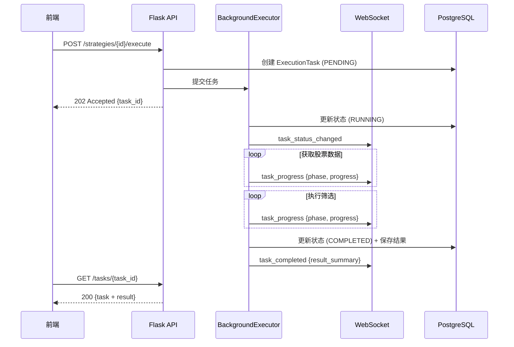
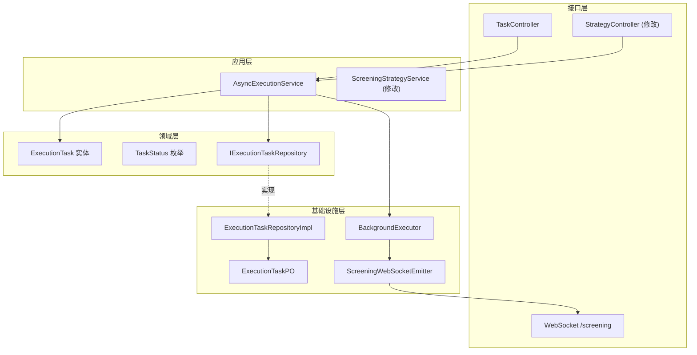

# 设计文档：异步策略执行

## 概述

本设计文档描述筛选策略异步执行功能的技术实现方案。核心思路是将同步阻塞的策略执行改为异步模式：

1. 前端调用 execute API 后立即返回任务 ID（HTTP 202）
2. 后端在后台线程池中执行策略筛选
3. 执行过程中通过 WebSocket 实时推送进度
4. 执行完成后通过 WebSocket 推送结果，同时持久化到数据库

系统复用现有的 Flask-SocketIO 基础设施（已在 Intelligence Context 中使用），在 `/screening` 命名空间下提供 WebSocket 支持。

## 架构

### 整体流程




### 组件架构



## 组件与接口

### 领域层组件

#### TaskStatus 枚举

```python
from enum import Enum

class TaskStatus(Enum):
    """执行任务状态"""
    PENDING = "pending"      # 等待执行
    RUNNING = "running"      # 执行中
    COMPLETED = "completed"  # 执行完成
    FAILED = "failed"        # 执行失败
    CANCELLED = "cancelled"  # 已取消
```

#### ExecutionTask 实体

```python
from datetime import datetime
from typing import Optional, Any, Dict
import uuid

class ExecutionTask:
    """执行任务实体"""
    
    def __init__(
        self,
        task_id: str,
        strategy_id: str,
        status: TaskStatus = TaskStatus.PENDING,
        progress: int = 0,
        total_steps: int = 100,
        current_step: str = "",
        result: Optional[Dict[str, Any]] = None,
        error_message: Optional[str] = None,
        created_at: Optional[datetime] = None,
        started_at: Optional[datetime] = None,
        completed_at: Optional[datetime] = None,
    ):
        self._task_id = task_id
        self._strategy_id = strategy_id
        self._status = status
        self._progress = progress
        self._total_steps = total_steps
        self._current_step = current_step
        self._result = result
        self._error_message = error_message
        self._created_at = created_at or datetime.utcnow()
        self._started_at = started_at
        self._completed_at = completed_at
        self._cancelled = False
    
    @classmethod
    def create(cls, strategy_id: str) -> 'ExecutionTask':
        """创建新任务，初始状态为 PENDING"""
        return cls(
            task_id=str(uuid.uuid4()),
            strategy_id=strategy_id,
            status=TaskStatus.PENDING,
            progress=0,
        )
    
    def start(self) -> None:
        """开始执行，状态转换为 RUNNING"""
        if self._status != TaskStatus.PENDING:
            raise InvalidTaskStateError(
                f"无法从 {self._status.value} 状态启动任务"
            )
        self._status = TaskStatus.RUNNING
        self._started_at = datetime.utcnow()
    
    def update_progress(self, progress: int, current_step: str) -> None:
        """更新执行进度"""
        if self._status != TaskStatus.RUNNING:
            return
        self._progress = min(progress, 100)
        self._current_step = current_step
    
    def complete(self, result: Dict[str, Any]) -> None:
        """完成执行，状态转换为 COMPLETED"""
        if self._status != TaskStatus.RUNNING:
            raise InvalidTaskStateError(
                f"无法从 {self._status.value} 状态完成任务"
            )
        self._status = TaskStatus.COMPLETED
        self._progress = 100
        self._result = result
        self._completed_at = datetime.utcnow()
    
    def fail(self, error_message: str) -> None:
        """执行失败，状态转换为 FAILED"""
        if self._status not in (TaskStatus.RUNNING, TaskStatus.PENDING):
            raise InvalidTaskStateError(
                f"无法从 {self._status.value} 状态标记失败"
            )
        self._status = TaskStatus.FAILED
        self._error_message = error_message
        self._completed_at = datetime.utcnow()
    
    def cancel(self) -> None:
        """取消任务"""
        if self._status not in (TaskStatus.PENDING, TaskStatus.RUNNING):
            raise InvalidTaskStateError(
                f"无法从 {self._status.value} 状态取消任务"
            )
        self._status = TaskStatus.CANCELLED
        self._cancelled = True
        self._completed_at = datetime.utcnow()
    
    @property
    def is_cancelled(self) -> bool:
        return self._cancelled
    
    # 属性访问器
    @property
    def task_id(self) -> str: return self._task_id
    @property
    def strategy_id(self) -> str: return self._strategy_id
    @property
    def status(self) -> TaskStatus: return self._status
    @property
    def progress(self) -> int: return self._progress
    @property
    def current_step(self) -> str: return self._current_step
    @property
    def result(self) -> Optional[Dict]: return self._result
    @property
    def error_message(self) -> Optional[str]: return self._error_message
    @property
    def created_at(self) -> datetime: return self._created_at
    @property
    def started_at(self) -> Optional[datetime]: return self._started_at
    @property
    def completed_at(self) -> Optional[datetime]: return self._completed_at
```


#### IExecutionTaskRepository 接口

```python
from abc import ABC, abstractmethod
from typing import List, Optional

class IExecutionTaskRepository(ABC):
    """执行任务仓储接口"""
    
    @abstractmethod
    def save(self, task: ExecutionTask) -> None:
        """保存或更新任务"""
        pass
    
    @abstractmethod
    def find_by_id(self, task_id: str) -> Optional[ExecutionTask]:
        """根据 ID 查找任务"""
        pass
    
    @abstractmethod
    def find_by_strategy_id(
        self, strategy_id: str, limit: int = 10
    ) -> List[ExecutionTask]:
        """查找策略的执行任务"""
        pass
    
    @abstractmethod
    def find_recent(self, limit: int = 20) -> List[ExecutionTask]:
        """查找最近的任务"""
        pass
    
    @abstractmethod
    def find_running_tasks(self) -> List[ExecutionTask]:
        """查找所有运行中的任务"""
        pass
    
    @abstractmethod
    def cleanup_old_tasks(self, keep_count: int = 100) -> int:
        """清理旧任务，保留最近 N 条"""
        pass
```

### 基础设施层组件

#### ExecutionTaskPO 模型

```python
from sqlalchemy import Column, String, Integer, Text, DateTime, Enum
from sqlalchemy.dialects.postgresql import JSONB
from app import db

class ExecutionTaskPO(db.Model):
    """执行任务持久化对象"""
    __tablename__ = 'execution_tasks'
    
    id = Column(String(36), primary_key=True)
    strategy_id = Column(String(36), nullable=False, index=True)
    status = Column(String(20), nullable=False, index=True)
    progress = Column(Integer, default=0)
    current_step = Column(String(200), default="")
    result = Column(JSONB, nullable=True)
    error_message = Column(Text, nullable=True)
    created_at = Column(DateTime, nullable=False, index=True)
    started_at = Column(DateTime, nullable=True)
    completed_at = Column(DateTime, nullable=True)
```

#### BackgroundExecutor 组件

```python
from concurrent.futures import ThreadPoolExecutor
from typing import Callable, Any
import threading
import logging

logger = logging.getLogger(__name__)

class BackgroundExecutor:
    """后台任务执行器"""
    
    _instance = None
    _lock = threading.Lock()
    
    def __new__(cls, max_workers: int = 3):
        if cls._instance is None:
            with cls._lock:
                if cls._instance is None:
                    cls._instance = super().__new__(cls)
                    cls._instance._executor = ThreadPoolExecutor(
                        max_workers=max_workers,
                        thread_name_prefix="screening_executor"
                    )
                    cls._instance._tasks = {}
        return cls._instance
    
    def submit(
        self,
        task_id: str,
        fn: Callable,
        *args,
        **kwargs
    ) -> None:
        """提交任务到线程池"""
        future = self._executor.submit(fn, *args, **kwargs)
        self._tasks[task_id] = future
        
        def cleanup(f):
            self._tasks.pop(task_id, None)
        
        future.add_done_callback(cleanup)
    
    def cancel(self, task_id: str) -> bool:
        """尝试取消任务"""
        future = self._tasks.get(task_id)
        if future:
            return future.cancel()
        return False
    
    def shutdown(self, wait: bool = True) -> None:
        """关闭执行器"""
        self._executor.shutdown(wait=wait)
```

#### ScreeningWebSocketEmitter 组件

```python
from flask_socketio import SocketIO
from typing import Dict, Any

class ScreeningWebSocketEmitter:
    """筛选上下文 WebSocket 事件推送器"""
    
    NAMESPACE = '/screening'
    
    def __init__(self, socketio: SocketIO):
        self._socketio = socketio
    
    def emit_status_changed(
        self, task_id: str, status: str, **extra
    ) -> None:
        """推送任务状态变化事件"""
        self._socketio.emit(
            'task_status_changed',
            {'task_id': task_id, 'status': status, **extra},
            namespace=self.NAMESPACE
        )
    
    def emit_progress(
        self,
        task_id: str,
        phase: str,
        progress: int,
        message: str,
        details: Dict[str, Any] = None
    ) -> None:
        """推送任务进度事件"""
        self._socketio.emit(
            'task_progress',
            {
                'task_id': task_id,
                'phase': phase,
                'progress': progress,
                'message': message,
                'details': details or {}
            },
            namespace=self.NAMESPACE
        )
    
    def emit_completed(
        self, task_id: str, result_summary: Dict[str, Any]
    ) -> None:
        """推送任务完成事件"""
        self._socketio.emit(
            'task_completed',
            {'task_id': task_id, 'result': result_summary},
            namespace=self.NAMESPACE
        )
    
    def emit_failed(self, task_id: str, error: str) -> None:
        """推送任务失败事件"""
        self._socketio.emit(
            'task_failed',
            {'task_id': task_id, 'error': error},
            namespace=self.NAMESPACE
        )
```


### 应用层组件

#### AsyncExecutionService

```python
from typing import Optional, Dict, Any, List
from flask import current_app

class AsyncExecutionService:
    """异步执行服务"""
    
    # 执行阶段定义
    PHASE_INIT = "init"
    PHASE_FETCH_LIST = "fetch_list"
    PHASE_FETCH_DATA = "fetch_data"
    PHASE_FILTER = "filter"
    PHASE_SCORE = "score"
    PHASE_SAVE = "save"
    
    def __init__(
        self,
        task_repo: IExecutionTaskRepository,
        strategy_repo: IScreeningStrategyRepository,
        session_repo: IScreeningSessionRepository,
        market_data_repo: IMarketDataRepository,
        scoring_service: IScoringService,
        calc_service: IIndicatorCalculationService,
        executor: BackgroundExecutor,
        ws_emitter: ScreeningWebSocketEmitter,
    ):
        self._task_repo = task_repo
        self._strategy_repo = strategy_repo
        self._session_repo = session_repo
        self._market_data_repo = market_data_repo
        self._scoring_service = scoring_service
        self._calc_service = calc_service
        self._executor = executor
        self._ws_emitter = ws_emitter
    
    def start_execution(self, strategy_id: str) -> ExecutionTask:
        """启动异步执行，返回任务对象"""
        # 验证策略存在
        strategy = self._strategy_repo.find_by_id(
            StrategyId.from_string(strategy_id)
        )
        if not strategy:
            raise StrategyNotFoundError(f"策略 {strategy_id} 不存在")
        
        # 创建任务
        task = ExecutionTask.create(strategy_id)
        self._task_repo.save(task)
        
        # 提交到后台执行
        self._executor.submit(
            task.task_id,
            self._execute_task,
            task.task_id,
            strategy_id
        )
        
        return task
    
    def _execute_task(self, task_id: str, strategy_id: str) -> None:
        """在后台线程中执行任务"""
        # 需要在 Flask 应用上下文中执行
        from app import create_app, db
        app = create_app()
        
        with app.app_context():
            task = self._task_repo.find_by_id(task_id)
            if not task:
                return
            
            try:
                # 开始执行
                task.start()
                self._task_repo.save(task)
                self._ws_emitter.emit_status_changed(
                    task_id, TaskStatus.RUNNING.value
                )
                
                # 阶段 1: 获取股票列表
                self._update_progress(task, self.PHASE_FETCH_LIST, 5, "获取股票列表...")
                stock_codes = self._market_data_repo.get_all_stock_codes()
                total_stocks = len(stock_codes)
                
                # 检查取消
                if task.is_cancelled:
                    return
                
                # 阶段 2: 获取股票数据（最耗时）
                self._update_progress(task, self.PHASE_FETCH_DATA, 10, 
                    f"开始获取 {total_stocks} 只股票数据...")
                
                stocks = self._fetch_stocks_with_progress(
                    task, stock_codes, total_stocks
                )
                
                if task.is_cancelled:
                    return
                
                # 阶段 3: 加载策略并执行筛选
                strategy = self._strategy_repo.find_by_id(
                    StrategyId.from_string(strategy_id)
                )
                
                self._update_progress(task, self.PHASE_FILTER, 70, "执行筛选条件...")
                matched = self._filter_with_progress(task, strategy, stocks)
                
                if task.is_cancelled:
                    return
                
                # 阶段 4: 评分
                self._update_progress(task, self.PHASE_SCORE, 85, "计算评分...")
                scored = self._scoring_service.score_stocks(
                    matched, strategy.scoring_config, self._calc_service
                )
                scored.sort(key=lambda s: s.score, reverse=True)
                
                # 阶段 5: 保存结果
                self._update_progress(task, self.PHASE_SAVE, 95, "保存结果...")
                
                result = ScreeningResult(
                    matched_stocks=scored,
                    total_scanned=len(stocks),
                    execution_time=0,  # 将在完成时计算
                    filters_applied=strategy.filters,
                    scoring_config=strategy.scoring_config
                )
                
                # 创建会话记录
                session = ScreeningSession.create_from_result(
                    strategy_id=strategy.strategy_id,
                    strategy_name=strategy.name,
                    result=result
                )
                self._session_repo.save(session)
                
                # 完成任务
                result_dict = {
                    'session_id': session.session_id.value,
                    'matched_count': len(scored),
                    'total_scanned': len(stocks),
                    'top_stocks': [
                        {'code': s.stock_code.code, 'name': s.stock_name, 'score': s.score}
                        for s in scored[:10]
                    ]
                }
                
                task.complete(result_dict)
                self._task_repo.save(task)
                self._ws_emitter.emit_completed(task_id, result_dict)
                
            except Exception as e:
                logger.exception(f"任务 {task_id} 执行失败")
                task.fail(str(e))
                self._task_repo.save(task)
                self._ws_emitter.emit_failed(task_id, str(e))
    
    def _fetch_stocks_with_progress(
        self, task: ExecutionTask, stock_codes: List, total: int
    ) -> List:
        """带进度报告的股票数据获取"""
        # 这里需要修改 market_data_repo 以支持进度回调
        # 简化实现：直接调用，定期更新进度
        stocks = []
        batch_size = 100
        
        for i in range(0, len(stock_codes), batch_size):
            if task.is_cancelled:
                return stocks
            
            batch = stock_codes[i:i+batch_size]
            batch_stocks = self._market_data_repo.get_stocks_by_codes(batch)
            stocks.extend(batch_stocks)
            
            progress = 10 + int((i + len(batch)) / total * 55)  # 10-65%
            self._update_progress(
                task, self.PHASE_FETCH_DATA, progress,
                f"已获取 {len(stocks)}/{total} 只股票数据"
            )
        
        return stocks
    
    def _filter_with_progress(
        self, task: ExecutionTask, strategy, stocks: List
    ) -> List:
        """带进度报告的筛选"""
        matched = []
        total = len(stocks)
        
        for i, stock in enumerate(stocks):
            if task.is_cancelled:
                return matched
            
            if strategy.filters.match(stock, self._calc_service):
                matched.append(stock)
            
            if i % 100 == 0:
                progress = 70 + int(i / total * 15)  # 70-85%
                self._update_progress(
                    task, self.PHASE_FILTER, progress,
                    f"已筛选 {i}/{total}，匹配 {len(matched)} 只"
                )
        
        return matched
    
    def _update_progress(
        self, task: ExecutionTask, phase: str, progress: int, message: str
    ) -> None:
        """更新进度并推送"""
        task.update_progress(progress, phase)
        self._task_repo.save(task)
        self._ws_emitter.emit_progress(
            task.task_id, phase, progress, message
        )
    
    def get_task(self, task_id: str) -> Optional[ExecutionTask]:
        """获取任务"""
        return self._task_repo.find_by_id(task_id)
    
    def list_tasks(self, limit: int = 20) -> List[ExecutionTask]:
        """列出最近任务"""
        return self._task_repo.find_recent(limit)
    
    def cancel_task(self, task_id: str) -> bool:
        """取消任务"""
        task = self._task_repo.find_by_id(task_id)
        if not task:
            raise TaskNotFoundError(f"任务 {task_id} 不存在")
        
        task.cancel()
        self._task_repo.save(task)
        self._executor.cancel(task_id)
        self._ws_emitter.emit_status_changed(
            task_id, TaskStatus.CANCELLED.value
        )
        return True
```


### 接口层组件

#### TaskController

```python
from flask import Blueprint, jsonify, request

task_bp = Blueprint('screening_tasks', __name__, 
                    url_prefix='/api/screening/tasks')

@task_bp.route('', methods=['GET'])
def list_tasks():
    """列出执行任务"""
    limit = request.args.get('limit', 20, type=int)
    tasks = execution_service.list_tasks(limit)
    return jsonify({
        'tasks': [TaskResponse.from_domain(t).to_dict() for t in tasks]
    })

@task_bp.route('/<task_id>', methods=['GET'])
def get_task(task_id: str):
    """获取任务详情"""
    task = execution_service.get_task(task_id)
    if not task:
        return jsonify({'error': f'任务 {task_id} 不存在'}), 404
    return jsonify(TaskResponse.from_domain(task).to_dict())

@task_bp.route('/<task_id>/cancel', methods=['POST'])
def cancel_task(task_id: str):
    """取消任务"""
    try:
        execution_service.cancel_task(task_id)
        return jsonify({'message': '任务已取消'})
    except TaskNotFoundError as e:
        return jsonify({'error': str(e)}), 404
    except InvalidTaskStateError as e:
        return jsonify({'error': str(e)}), 409
```

#### 修改 StrategyController

```python
# 修改 execute_strategy 端点
@strategy_bp.route('/<strategy_id>/execute', methods=['POST'])
def execute_strategy(strategy_id: str):
    """
    异步执行筛选策略
    
    Returns:
        202: 任务已创建，返回 task_id
        404: 策略不存在
    """
    try:
        task = execution_service.start_execution(strategy_id)
        return jsonify({
            'task_id': task.task_id,
            'status': task.status.value,
            'message': '任务已提交，请通过 WebSocket 或轮询获取进度'
        }), 202
    except StrategyNotFoundError as e:
        return jsonify({'error': str(e)}), 404
```

#### TaskResponse DTO

```python
from dataclasses import dataclass
from typing import Optional, Dict, Any
from datetime import datetime

@dataclass
class TaskResponse:
    task_id: str
    strategy_id: str
    status: str
    progress: int
    current_step: str
    result: Optional[Dict[str, Any]]
    error_message: Optional[str]
    created_at: str
    started_at: Optional[str]
    completed_at: Optional[str]
    
    @classmethod
    def from_domain(cls, task: ExecutionTask) -> 'TaskResponse':
        return cls(
            task_id=task.task_id,
            strategy_id=task.strategy_id,
            status=task.status.value,
            progress=task.progress,
            current_step=task.current_step,
            result=task.result,
            error_message=task.error_message,
            created_at=task.created_at.isoformat(),
            started_at=task.started_at.isoformat() if task.started_at else None,
            completed_at=task.completed_at.isoformat() if task.completed_at else None,
        )
    
    def to_dict(self) -> Dict[str, Any]:
        return {
            'task_id': self.task_id,
            'strategy_id': self.strategy_id,
            'status': self.status,
            'progress': self.progress,
            'current_step': self.current_step,
            'result': self.result,
            'error_message': self.error_message,
            'created_at': self.created_at,
            'started_at': self.started_at,
            'completed_at': self.completed_at,
        }
```

## 数据模型

### 新增表结构

```sql
CREATE TABLE execution_tasks (
    id VARCHAR(36) PRIMARY KEY,
    strategy_id VARCHAR(36) NOT NULL,
    status VARCHAR(20) NOT NULL DEFAULT 'pending',
    progress INTEGER DEFAULT 0,
    current_step VARCHAR(200) DEFAULT '',
    result JSONB,
    error_message TEXT,
    created_at TIMESTAMP NOT NULL,
    started_at TIMESTAMP,
    completed_at TIMESTAMP
);

CREATE INDEX idx_execution_tasks_strategy_id ON execution_tasks(strategy_id);
CREATE INDEX idx_execution_tasks_status ON execution_tasks(status);
CREATE INDEX idx_execution_tasks_created_at ON execution_tasks(created_at DESC);
```

### Nginx 配置更新

```nginx
# API 请求代理到 Flask 后端
location /api/ {
    proxy_pass http://flask:5015;
    proxy_set_header Host $host;
    proxy_set_header X-Real-IP $remote_addr;
    proxy_set_header X-Forwarded-For $proxy_add_x_forwarded_for;
    proxy_set_header X-Forwarded-Proto $scheme;
    
    # 增加超时配置
    proxy_connect_timeout 60s;
    proxy_send_timeout 60s;
    proxy_read_timeout 300s;  # 5分钟，支持长轮询场景
}
```


## 正确性属性

*正确性属性是系统在所有有效执行中都应保持为真的特征或行为——本质上是关于系统应该做什么的形式化陈述。属性是人类可读规范与机器可验证正确性保证之间的桥梁。*

### Property 1: ExecutionTask 初始状态

*对于任意*有效的 strategy_id，调用 `ExecutionTask.create(strategy_id)` 创建的任务，其 status 应为 PENDING，progress 应为 0。

**Validates: Requirements 1.3**

### Property 2: ExecutionTask 有效状态转换

*对于任意* ExecutionTask：
- 如果当前状态为 PENDING，调用 `start()` 后状态应为 RUNNING，且 started_at 不为 None
- 如果当前状态为 RUNNING，调用 `complete(result)` 后状态应为 COMPLETED，且 result 等于传入值，completed_at 不为 None
- 如果当前状态为 RUNNING，调用 `fail(error)` 后状态应为 FAILED，且 error_message 等于传入值

**Validates: Requirements 1.4, 1.5, 1.6**

### Property 3: ExecutionTask 非法状态转换抛出异常

*对于任意* ExecutionTask 和任意非法的状态转换（如从 COMPLETED 调用 start()），应抛出 InvalidTaskStateError。

非法转换包括：
- 从 RUNNING/COMPLETED/FAILED/CANCELLED 调用 start()
- 从 PENDING/COMPLETED/FAILED/CANCELLED 调用 complete()
- 从 COMPLETED/FAILED/CANCELLED 调用 fail()
- 从 COMPLETED/FAILED 调用 cancel()

**Validates: Requirements 1.7**

### Property 4: BackgroundExecutor 立即返回

*对于任意*提交到 BackgroundExecutor 的任务，submit() 方法应在 100ms 内返回，不阻塞调用线程。

**Validates: Requirements 3.2**

### Property 5: 进度百分比计算

*对于任意*正整数 total 和任意 0 <= current <= total：
- 获取股票数据阶段的进度应在 10-65% 范围内，计算公式为 `10 + (current/total) * 55`
- 执行筛选阶段的进度应在 70-85% 范围内，计算公式为 `70 + (current/total) * 15`

**Validates: Requirements 5.2, 5.3**

### Property 6: 进度更新结构完整性

*对于任意*通过 WebSocket 推送的 task_progress 事件，应包含以下字段：task_id（非空字符串）、phase（非空字符串）、progress（0-100 整数）、message（字符串）。

**Validates: Requirements 5.4, 4.6**

### Property 7: 任务保留策略

*对于任意*时刻，调用 `cleanup_old_tasks(keep_count=N)` 后，数据库中的任务记录数应不超过 N 条，且保留的是最近创建的 N 条记录。

**Validates: Requirements 8.4**

## 错误处理

| 错误场景 | 异常类型 | HTTP 状态码 |
|---------|---------|------------|
| 策略不存在 | StrategyNotFoundError | 404 |
| 任务不存在 | TaskNotFoundError | 404 |
| 非法状态转换 | InvalidTaskStateError | 409 |
| 执行过程异常 | 各种 Exception | 通过 WebSocket 推送 |

## 测试策略

### 单元测试

1. ExecutionTask 状态转换测试
2. TaskStatus 枚举值测试
3. BackgroundExecutor 任务提交测试
4. ScreeningWebSocketEmitter 事件格式测试

### 属性测试

使用 Hypothesis 库进行属性基测试：

1. Property 1: 初始状态测试
2. Property 2: 有效状态转换测试
3. Property 3: 非法状态转换测试
4. Property 5: 进度计算测试
5. Property 6: 进度更新结构测试
6. Property 7: 任务保留策略测试

### 集成测试

1. 完整执行流程测试（使用 mock 数据）
2. WebSocket 事件推送测试
3. 任务取消测试
4. 服务重启后任务状态恢复测试

## 前端集成

### API 服务扩展

```javascript
// services/screeningApi.js
export const screeningApi = {
  // ... 现有方法
  
  // 异步执行策略
  executeStrategy: (id) => apiClient.post(`/screening/strategies/${id}/execute`),
  
  // 任务相关
  getTasks: (params) => apiClient.get('/screening/tasks', { params }),
  getTask: (id) => apiClient.get(`/screening/tasks/${id}`),
  cancelTask: (id) => apiClient.post(`/screening/tasks/${id}/cancel`),
};
```

### WebSocket 连接

```javascript
// services/screeningSocket.js
import { io } from 'socket.io-client';

class ScreeningSocket {
  constructor() {
    this.socket = null;
    this.listeners = new Map();
  }
  
  connect() {
    this.socket = io('/screening', {
      transports: ['websocket', 'polling'],
    });
    
    this.socket.on('task_progress', (data) => {
      this._emit('progress', data);
    });
    
    this.socket.on('task_completed', (data) => {
      this._emit('completed', data);
    });
    
    this.socket.on('task_failed', (data) => {
      this._emit('failed', data);
    });
    
    this.socket.on('task_status_changed', (data) => {
      this._emit('status', data);
    });
  }
  
  subscribe(taskId, callbacks) {
    this.listeners.set(taskId, callbacks);
  }
  
  unsubscribe(taskId) {
    this.listeners.delete(taskId);
  }
  
  _emit(event, data) {
    const callbacks = this.listeners.get(data.task_id);
    if (callbacks && callbacks[event]) {
      callbacks[event](data);
    }
  }
  
  disconnect() {
    if (this.socket) {
      this.socket.disconnect();
      this.socket = null;
    }
  }
}

export const screeningSocket = new ScreeningSocket();
```

### 执行进度组件

```jsx
// components/ExecutionProgress.jsx
import { Progress, Card, Typography, Button } from 'antd';
import { useEffect, useState } from 'react';
import { screeningSocket } from '../services/screeningSocket';
import { screeningApi } from '../services/screeningApi';

export function ExecutionProgress({ taskId, onComplete, onFailed }) {
  const [progress, setProgress] = useState(0);
  const [phase, setPhase] = useState('');
  const [message, setMessage] = useState('准备执行...');
  
  useEffect(() => {
    screeningSocket.connect();
    
    screeningSocket.subscribe(taskId, {
      progress: (data) => {
        setProgress(data.progress);
        setPhase(data.phase);
        setMessage(data.message);
      },
      completed: (data) => {
        setProgress(100);
        setMessage('执行完成');
        onComplete?.(data.result);
      },
      failed: (data) => {
        setMessage(`执行失败: ${data.error}`);
        onFailed?.(data.error);
      },
    });
    
    return () => {
      screeningSocket.unsubscribe(taskId);
    };
  }, [taskId]);
  
  const handleCancel = async () => {
    await screeningApi.cancelTask(taskId);
  };
  
  return (
    <Card title="策略执行中">
      <Progress percent={progress} status="active" />
      <Typography.Text>{message}</Typography.Text>
      <Button onClick={handleCancel} danger>取消</Button>
    </Card>
  );
}
```
