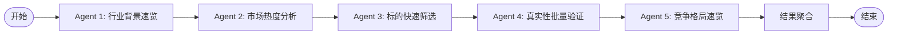

# 设计文档：智能分析上下文（Investment Intelligence Context）

## 概述

本设计文档描述 Investment Intelligence Context 的完整技术实现方案。该上下文负责 AI 驱动的快速行业认知（5-Agent LangGraph 工作流）和概念可信度验证。系统采用 DDD 四层架构，后端使用 Python Flask + SQLAlchemy + PostgreSQL，AI 编排使用 LangGraph + DeepSeek，实时进度推送使用 Flask-SocketIO（WebSocket），LangGraph 状态持久化使用 Redis。

核心设计原则：
- 依赖倒置：领域层定义接口，基础设施层实现
- 领域层零技术依赖：纯 Python，不导入 Flask/SQLAlchemy/LangGraph
- 异步工作流：LangGraph 工作流异步执行，通过 WebSocket 推送进度
- 数据源解耦：新闻爬虫、公告接口通过抽象接口隔离
- 与 Screening Context 无运行时依赖，仅通过 Shared Kernel 共享 StockCode 和 IMarketDataRepository

## 架构

### 整体架构


### 依赖方向

Interface Layer -> Application Layer -> Domain Layer <- Infrastructure Layer

领域层是核心，不依赖任何外层。基础设施层实现领域层定义的接口。LangGraph 工作流属于基础设施层，实现领域层的 IIndustryResearchService 和 ICredibilityVerificationService 接口。

### 项目目录结构

```
src/backend/contexts/intelligence/          # 智能分析上下文
├── __init__.py
├── interface/                              # 接口层
│   ├── __init__.py
│   ├── controllers/
│   │   ├── __init__.py
│   │   └── intelligence_controller.py      # REST API
│   └── dto/
│       ├── __init__.py
│       ├── task_request_dto.py             # 请求 DTO
│       └── task_response_dto.py            # 响应 DTO
├── application/                            # 应用层
│   ├── __init__.py
│   └── services/
│       ├── __init__.py
│       └── investigation_task_service.py   # 应用服务
├── domain/                                 # 领域层
│   ├── __init__.py
│   ├── exceptions.py                       # 领域异常
│   ├── enums/
│   │   ├── __init__.py
│   │   └── enums.py                        # TaskType, TaskStatus, RiskLabel 等
│   ├── models/
│   │   ├── __init__.py
│   │   └── investigation_task.py           # 聚合根
│   ├── value_objects/
│   │   ├── __init__.py
│   │   ├── identifiers.py                 # TaskId
│   │   ├── credibility_score.py            # CredibilityScore
│   │   ├── agent_step.py                   # AgentStep
│   │   ├── industry_insight.py             # IndustryInsight
│   │   ├── credibility_report.py           # CredibilityReport + 子值对象
│   │   └── stock_credibility.py            # StockCredibility
│   ├── repositories/
│   │   ├── __init__.py
│   │   ├── investigation_task_repository.py
│   │   ├── news_data_provider.py
│   │   └── announcement_data_provider.py
│   └── services/
│       ├── __init__.py
│       ├── industry_research_service.py    # IIndustryResearchService 接口
│       └── credibility_verification_service.py  # ICredibilityVerificationService 接口
└── infrastructure/                         # 基础设施层
    ├── __init__.py
    ├── persistence/
    │   ├── __init__.py
    │   ├── models/
    │   │   ├── __init__.py
    │   │   └── investigation_task_po.py    # ORM PO 模型
    │   └── repositories/
    │       ├── __init__.py
    │       └── investigation_task_repository_impl.py
    ├── services/
    │   ├── __init__.py
    │   ├── industry_research_service_impl.py
    │   └── credibility_verification_service_impl.py
    └── ai/
        ├── __init__.py
        ├── deepseek_client.py              # DeepSeek LLM 客户端
        ├── industry_research_workflow.py    # 快速行业认知 LangGraph 工作流
        └── credibility_workflow.py          # 概念可信度验证 LangGraph 工作流
```

## 组件与接口

### 领域层组件

#### 枚举设计

```python
from enum import Enum

class TaskType(Enum):
    INDUSTRY_RESEARCH = "industry_research"       # 快速行业认知
    CREDIBILITY_VERIFICATION = "credibility_verification"  # 概念可信度验证

class TaskStatus(Enum):
    PENDING = "pending"
    RUNNING = "running"
    COMPLETED = "completed"
    FAILED = "failed"
    CANCELLED = "cancelled"

class AgentStepStatus(Enum):
    PENDING = "pending"
    RUNNING = "running"
    COMPLETED = "completed"
    FAILED = "failed"
    SKIPPED = "skipped"

class RiskLabel(Enum):
    PURE_HYPE = "pure_hype"                       # 纯蹭热点
    WEAK_EVIDENCE = "weak_evidence"               # 证据不足
    BUSINESS_MISMATCH = "business_mismatch"       # 主业不匹配
    HIGH_DEBT = "high_debt"                       # 高负债风险
    FREQUENT_CONCEPT_CHANGE = "frequent_concept_change"  # 频繁概念切换
    SUPPLY_CHAIN_RISK = "supply_chain_risk"       # 供应链风险
```

#### 标识符值对象

```python
import uuid

class TaskId:
    """调研任务唯一标识符"""
    def __init__(self, value: str):
        try:
            uuid.UUID(value)
        except ValueError:
            raise ValueError(f"无效的 TaskId 格式: {value}")
        self._value = value

    @classmethod
    def generate(cls) -> 'TaskId':
        return cls(str(uuid.uuid4()))

    @classmethod
    def from_string(cls, value: str) -> 'TaskId':
        return cls(value)

    @property
    def value(self) -> str:
        return self._value

    def __eq__(self, other):
        return isinstance(other, TaskId) and self._value == other._value

    def __hash__(self):
        return hash(self._value)

    def __repr__(self):
        return f"TaskId('{self._value}')"
```

#### CredibilityScore 值对象

```python
class CredibilityScore:
    """可信度评分（0-100）"""
    def __init__(self, score: int):
        if not isinstance(score, int) or score < 0 or score > 100:
            raise ValueError(f"可信度评分必须是 0-100 的整数，收到: {score}")
        self._score = score

    @property
    def score(self) -> int:
        return self._score

    @property
    def level(self) -> str:
        """返回可信度等级"""
        if self._score >= 80:
            return "高可信度"
        elif self._score >= 50:
            return "中可信度"
        else:
            return "低可信度"

    def to_dict(self) -> dict:
        return {"score": self._score, "level": self.level}

    @classmethod
    def from_dict(cls, data: dict) -> 'CredibilityScore':
        return cls(score=data["score"])

    def __eq__(self, other):
        return isinstance(other, CredibilityScore) and self._score == other._score

    def __hash__(self):
        return hash(self._score)
```

#### AgentStep 值对象

```python
from datetime import datetime
from typing import Optional

class AgentStep:
    """LangGraph 工作流中单个 Agent 的执行记录"""
    def __init__(self, agent_name: str, status: AgentStepStatus,
                 started_at: Optional[datetime] = None,
                 completed_at: Optional[datetime] = None,
                 output_summary: Optional[str] = None,
                 error_message: Optional[str] = None):
        self._agent_name = agent_name
        self._status = status
        self._started_at = started_at
        self._completed_at = completed_at
        self._output_summary = output_summary
        self._error_message = error_message

    @property
    def agent_name(self) -> str: return self._agent_name
    @property
    def status(self) -> AgentStepStatus: return self._status
    @property
    def started_at(self) -> Optional[datetime]: return self._started_at
    @property
    def completed_at(self) -> Optional[datetime]: return self._completed_at
    @property
    def output_summary(self) -> Optional[str]: return self._output_summary
    @property
    def error_message(self) -> Optional[str]: return self._error_message

    def to_dict(self) -> dict:
        return {
            "agent_name": self._agent_name,
            "status": self._status.value,
            "started_at": self._started_at.isoformat() if self._started_at else None,
            "completed_at": self._completed_at.isoformat() if self._completed_at else None,
            "output_summary": self._output_summary,
            "error_message": self._error_message,
        }

    @classmethod
    def from_dict(cls, data: dict) -> 'AgentStep':
        return cls(
            agent_name=data["agent_name"],
            status=AgentStepStatus(data["status"]),
            started_at=datetime.fromisoformat(data["started_at"]) if data.get("started_at") else None,
            completed_at=datetime.fromisoformat(data["completed_at"]) if data.get("completed_at") else None,
            output_summary=data.get("output_summary"),
            error_message=data.get("error_message"),
        )
```

#### StockCredibility 值对象

```python
class StockCredibility:
    """个股可信度（用于行业认知结果中的核心标的列表）"""
    def __init__(self, stock_code: 'StockCode', stock_name: str,
                 credibility_score: CredibilityScore,
                 relevance_summary: str):
        self._stock_code = stock_code
        self._stock_name = stock_name
        self._credibility_score = credibility_score
        self._relevance_summary = relevance_summary

    @property
    def stock_code(self): return self._stock_code
    @property
    def stock_name(self): return self._stock_name
    @property
    def credibility_score(self): return self._credibility_score
    @property
    def relevance_summary(self): return self._relevance_summary

    def to_dict(self) -> dict:
        return {
            "stock_code": self._stock_code.code,
            "stock_name": self._stock_name,
            "credibility_score": self._credibility_score.to_dict(),
            "relevance_summary": self._relevance_summary,
        }

    @classmethod
    def from_dict(cls, data: dict) -> 'StockCredibility':
        return cls(
            stock_code=StockCode(data["stock_code"]),
            stock_name=data["stock_name"],
            credibility_score=CredibilityScore.from_dict(data["credibility_score"]),
            relevance_summary=data["relevance_summary"],
        )
```

#### IndustryInsight 值对象

```python
class IndustryInsight:
    """快速行业认知工作流的输出结果"""
    def __init__(self, industry_name: str, summary: str,
                 industry_chain: str, technology_routes: list,
                 market_size: str, top_stocks: list,
                 risk_alerts: list, catalysts: list,
                 heat_score: int, competitive_landscape: str):
        self._industry_name = industry_name
        self._summary = summary
        self._industry_chain = industry_chain
        self._technology_routes = technology_routes
        self._market_size = market_size
        self._top_stocks = top_stocks          # List[StockCredibility]
        self._risk_alerts = risk_alerts        # List[str]
        self._catalysts = catalysts            # List[str]
        self._heat_score = heat_score          # 0-100
        self._competitive_landscape = competitive_landscape

    # 属性访问器省略，与上述模式一致

    def to_dict(self) -> dict:
        return {
            "industry_name": self._industry_name,
            "summary": self._summary,
            "industry_chain": self._industry_chain,
            "technology_routes": self._technology_routes,
            "market_size": self._market_size,
            "top_stocks": [s.to_dict() for s in self._top_stocks],
            "risk_alerts": self._risk_alerts,
            "catalysts": self._catalysts,
            "heat_score": self._heat_score,
            "competitive_landscape": self._competitive_landscape,
        }

    @classmethod
    def from_dict(cls, data: dict) -> 'IndustryInsight':
        return cls(
            industry_name=data["industry_name"],
            summary=data["summary"],
            industry_chain=data["industry_chain"],
            technology_routes=data["technology_routes"],
            market_size=data["market_size"],
            top_stocks=[StockCredibility.from_dict(s) for s in data["top_stocks"]],
            risk_alerts=data["risk_alerts"],
            catalysts=data["catalysts"],
            heat_score=data["heat_score"],
            competitive_landscape=data["competitive_landscape"],
        )
```

#### CredibilityReport 及子值对象

```python
class MainBusinessMatch:
    """主营业务匹配度分析"""
    def __init__(self, score: int, main_business_description: str, match_analysis: str):
        self._score = score  # 0-100
        self._main_business_description = main_business_description
        self._match_analysis = match_analysis

    @property
    def score(self): return self._score
    @property
    def main_business_description(self): return self._main_business_description
    @property
    def match_analysis(self): return self._match_analysis

    def to_dict(self) -> dict:
        return {"score": self._score, "main_business_description": self._main_business_description,
                "match_analysis": self._match_analysis}

    @classmethod
    def from_dict(cls, data: dict) -> 'MainBusinessMatch':
        return cls(score=data["score"], main_business_description=data["main_business_description"],
                   match_analysis=data["match_analysis"])


class EvidenceAnalysis:
    """实质证据分析（专利/订单/合作伙伴）"""
    def __init__(self, score: int, patents: list, orders: list,
                 partnerships: list, analysis: str):
        self._score = score
        self._patents = patents
        self._orders = orders
        self._partnerships = partnerships
        self._analysis = analysis

    def to_dict(self) -> dict:
        return {"score": self._score, "patents": self._patents, "orders": self._orders,
                "partnerships": self._partnerships, "analysis": self._analysis}

    @classmethod
    def from_dict(cls, data: dict) -> 'EvidenceAnalysis':
        return cls(score=data["score"], patents=data["patents"], orders=data["orders"],
                   partnerships=data["partnerships"], analysis=data["analysis"])


class HypeHistory:
    """历史蹭热点记录分析"""
    def __init__(self, score: int, past_concepts: list, analysis: str):
        self._score = score  # 越高越可信（历史蹭热点越少）
        self._past_concepts = past_concepts
        self._analysis = analysis

    def to_dict(self) -> dict:
        return {"score": self._score, "past_concepts": self._past_concepts,
                "analysis": self._analysis}

    @classmethod
    def from_dict(cls, data: dict) -> 'HypeHistory':
        return cls(score=data["score"], past_concepts=data["past_concepts"],
                   analysis=data["analysis"])


class SupplyChainLogic:
    """供应链逻辑合理性分析"""
    def __init__(self, score: int, upstream: list, downstream: list, analysis: str):
        self._score = score
        self._upstream = upstream
        self._downstream = downstream
        self._analysis = analysis

    def to_dict(self) -> dict:
        return {"score": self._score, "upstream": self._upstream,
                "downstream": self._downstream, "analysis": self._analysis}

    @classmethod
    def from_dict(cls, data: dict) -> 'SupplyChainLogic':
        return cls(score=data["score"], upstream=data["upstream"],
                   downstream=data["downstream"], analysis=data["analysis"])


class CredibilityReport:
    """概念可信度验证的完整报告"""
    def __init__(self, stock_code, stock_name: str, concept: str,
                 overall_score: CredibilityScore,
                 main_business_match: MainBusinessMatch,
                 evidence: EvidenceAnalysis,
                 hype_history: HypeHistory,
                 supply_chain_logic: SupplyChainLogic,
                 risk_labels: list, conclusion: str):
        self._stock_code = stock_code
        self._stock_name = stock_name
        self._concept = concept
        self._overall_score = overall_score
        self._main_business_match = main_business_match
        self._evidence = evidence
        self._hype_history = hype_history
        self._supply_chain_logic = supply_chain_logic
        self._risk_labels = risk_labels  # List[RiskLabel]
        self._conclusion = conclusion

    # 属性访问器省略

    def to_dict(self) -> dict:
        return {
            "stock_code": self._stock_code.code,
            "stock_name": self._stock_name,
            "concept": self._concept,
            "overall_score": self._overall_score.to_dict(),
            "main_business_match": self._main_business_match.to_dict(),
            "evidence": self._evidence.to_dict(),
            "hype_history": self._hype_history.to_dict(),
            "supply_chain_logic": self._supply_chain_logic.to_dict(),
            "risk_labels": [r.value for r in self._risk_labels],
            "conclusion": self._conclusion,
        }

    @classmethod
    def from_dict(cls, data: dict) -> 'CredibilityReport':
        return cls(
            stock_code=StockCode(data["stock_code"]),
            stock_name=data["stock_name"],
            concept=data["concept"],
            overall_score=CredibilityScore.from_dict(data["overall_score"]),
            main_business_match=MainBusinessMatch.from_dict(data["main_business_match"]),
            evidence=EvidenceAnalysis.from_dict(data["evidence"]),
            hype_history=HypeHistory.from_dict(data["hype_history"]),
            supply_chain_logic=SupplyChainLogic.from_dict(data["supply_chain_logic"]),
            risk_labels=[RiskLabel(r) for r in data["risk_labels"]],
            conclusion=data["conclusion"],
        )
```

#### InvestigationTask 聚合根

```python
from datetime import datetime
from typing import Optional, List, Union

class InvestigationTask:
    """调研任务聚合根 - 管理任务生命周期"""

    def __init__(self, task_id: TaskId, task_type: TaskType,
                 query: str, status: TaskStatus = TaskStatus.PENDING,
                 progress: int = 0, agent_steps: List[AgentStep] = None,
                 result: Union[IndustryInsight, CredibilityReport, None] = None,
                 error_message: Optional[str] = None,
                 created_at: Optional[datetime] = None,
                 updated_at: Optional[datetime] = None,
                 completed_at: Optional[datetime] = None):
        if not query or not query.strip():
            raise ValueError("查询文本不能为空")
        self._task_id = task_id
        self._task_type = task_type
        self._query = query.strip()
        self._status = status
        self._progress = progress
        self._agent_steps = agent_steps or []
        self._result = result
        self._error_message = error_message
        self._created_at = created_at or datetime.utcnow()
        self._updated_at = updated_at or datetime.utcnow()
        self._completed_at = completed_at

    # === 状态转换方法 ===

    def start(self):
        """启动任务：PENDING -> RUNNING"""
        if self._status != TaskStatus.PENDING:
            raise InvalidTaskStateError(
                f"只能从 PENDING 状态启动任务，当前状态: {self._status.value}")
        self._status = TaskStatus.RUNNING
        self._updated_at = datetime.utcnow()

    def update_progress(self, progress: int, agent_step: AgentStep):
        """更新进度并追加 Agent 步骤"""
        self._progress = max(0, min(100, progress))
        self._agent_steps.append(agent_step)
        self._updated_at = datetime.utcnow()

    def complete(self, result: Union[IndustryInsight, CredibilityReport]):
        """完成任务：RUNNING -> COMPLETED"""
        if self._status != TaskStatus.RUNNING:
            raise InvalidTaskStateError(
                f"只能从 RUNNING 状态完成任务，当前状态: {self._status.value}")
        self._status = TaskStatus.COMPLETED
        self._result = result
        self._progress = 100
        self._completed_at = datetime.utcnow()
        self._updated_at = datetime.utcnow()

    def fail(self, error_message: str):
        """标记任务失败：RUNNING -> FAILED"""
        if self._status != TaskStatus.RUNNING:
            raise InvalidTaskStateError(
                f"只能从 RUNNING 状态标记失败，当前状态: {self._status.value}")
        self._status = TaskStatus.FAILED
        self._error_message = error_message
        self._completed_at = datetime.utcnow()
        self._updated_at = datetime.utcnow()

    def cancel(self):
        """取消任务：PENDING/RUNNING -> CANCELLED"""
        if self._status not in (TaskStatus.PENDING, TaskStatus.RUNNING):
            raise InvalidTaskStateError(
                f"只能取消 PENDING 或 RUNNING 状态的任务，当前状态: {self._status.value}")
        self._status = TaskStatus.CANCELLED
        self._completed_at = datetime.utcnow()
        self._updated_at = datetime.utcnow()

    @property
    def duration(self) -> Optional[float]:
        """返回任务执行时长（秒），未完成返回 None"""
        if self._completed_at is None:
            return None
        return (self._completed_at - self._created_at).total_seconds()

    # 属性访问器
    @property
    def task_id(self): return self._task_id
    @property
    def task_type(self): return self._task_type
    @property
    def query(self): return self._query
    @property
    def status(self): return self._status
    @property
    def progress(self): return self._progress
    @property
    def agent_steps(self): return list(self._agent_steps)
    @property
    def result(self): return self._result
    @property
    def error_message(self): return self._error_message
    @property
    def created_at(self): return self._created_at
    @property
    def updated_at(self): return self._updated_at
    @property
    def completed_at(self): return self._completed_at
```

#### 领域服务接口

```python
from abc import ABC, abstractmethod

class IIndustryResearchService(ABC):
    """快速行业认知服务接口"""
    @abstractmethod
    async def execute_research(self, query: str,
                                progress_callback=None) -> IndustryInsight:
        """执行快速行业认知工作流
        Args:
            query: 用户查询（如"快速了解合成生物学赛道"）
            progress_callback: 进度回调函数 (progress: int, agent_step: AgentStep) -> None
        Returns:
            IndustryInsight 值对象
        """
        pass

class ICredibilityVerificationService(ABC):
    """概念可信度验证服务接口"""
    @abstractmethod
    async def verify_credibility(self, stock_code: 'StockCode',
                                  concept: str,
                                  progress_callback=None) -> CredibilityReport:
        """执行概念可信度验证
        Args:
            stock_code: 股票代码
            concept: 被验证的概念
            progress_callback: 进度回调函数
        Returns:
            CredibilityReport 值对象
        """
        pass
```

#### Repository 接口

```python
class IInvestigationTaskRepository(ABC):
    @abstractmethod
    def save(self, task: InvestigationTask) -> None: ...

    @abstractmethod
    def find_by_id(self, task_id: TaskId) -> Optional[InvestigationTask]: ...

    @abstractmethod
    def find_by_status(self, status: TaskStatus,
                       limit: int = 20) -> List[InvestigationTask]: ...

    @abstractmethod
    def find_recent_tasks(self, limit: int = 20,
                          offset: int = 0) -> List[InvestigationTask]: ...

    @abstractmethod
    def delete(self, task_id: TaskId) -> None: ...

    @abstractmethod
    def count_by_status(self, status: TaskStatus) -> int: ...
```

#### 数据提供者接口

```python
class NewsItem:
    """新闻数据项"""
    def __init__(self, title: str, source: str, published_at: datetime,
                 url: str, summary: str):
        self.title = title
        self.source = source
        self.published_at = published_at
        self.url = url
        self.summary = summary

class Announcement:
    """公司公告数据项"""
    def __init__(self, title: str, published_at: datetime,
                 content: str, announcement_type: str):
        self.title = title
        self.published_at = published_at
        self.content = content
        self.announcement_type = announcement_type

class INewsDataProvider(ABC):
    @abstractmethod
    def fetch_news(self, query: str, days: int = 7) -> List[NewsItem]: ...

class IAnnouncementDataProvider(ABC):
    @abstractmethod
    def fetch_announcements(self, stock_code: 'StockCode',
                            days: int = 30) -> List[Announcement]: ...
```

#### 领域异常

```python
class IntelligenceDomainError(Exception):
    """智能分析上下文基础异常"""
    pass

class InvalidTaskStateError(IntelligenceDomainError):
    """无效的任务状态转换"""
    pass

class TaskNotFoundError(IntelligenceDomainError):
    """任务不存在"""
    pass

class AnalysisTimeoutError(IntelligenceDomainError):
    """分析超时"""
    pass

class LLMServiceError(IntelligenceDomainError):
    """LLM 服务调用错误"""
    pass
```

### 基础设施层组件

#### PO 模型（SQLAlchemy）

```python
from sqlalchemy import Column, String, Text, Integer, Float, DateTime, Enum as SAEnum
from sqlalchemy.dialects.postgresql import JSONB

class InvestigationTaskPO(db.Model):
    __tablename__ = 'investigation_tasks'
    id = Column(String(36), primary_key=True)
    task_type = Column(String(50), nullable=False)
    query = Column(Text, nullable=False)
    status = Column(String(20), nullable=False, index=True)
    progress = Column(Integer, nullable=False, default=0)
    agent_steps = Column(JSONB, default=[])
    result = Column(JSONB, nullable=True)       # IndustryInsight 或 CredibilityReport 的 JSON
    result_type = Column(String(50), nullable=True)  # 区分 result 类型
    error_message = Column(Text, nullable=True)
    created_at = Column(DateTime, nullable=False, index=True)
    updated_at = Column(DateTime, nullable=False)
    completed_at = Column(DateTime, nullable=True)
```

#### Repository 实现

```python
class InvestigationTaskRepositoryImpl(IInvestigationTaskRepository):
    def __init__(self, session):
        self._session = session

    def save(self, task: InvestigationTask) -> None:
        po = self._to_po(task)
        self._session.merge(po)
        self._session.flush()

    def find_by_id(self, task_id: TaskId) -> Optional[InvestigationTask]:
        po = self._session.query(InvestigationTaskPO).get(task_id.value)
        return self._to_domain(po) if po else None

    def find_recent_tasks(self, limit=20, offset=0):
        pos = (self._session.query(InvestigationTaskPO)
               .order_by(InvestigationTaskPO.created_at.desc())
               .offset(offset).limit(limit).all())
        return [self._to_domain(po) for po in pos]

    def _to_po(self, task: InvestigationTask) -> InvestigationTaskPO:
        result_dict = task.result.to_dict() if task.result else None
        result_type = None
        if isinstance(task.result, IndustryInsight):
            result_type = "industry_insight"
        elif isinstance(task.result, CredibilityReport):
            result_type = "credibility_report"
        return InvestigationTaskPO(
            id=task.task_id.value,
            task_type=task.task_type.value,
            query=task.query,
            status=task.status.value,
            progress=task.progress,
            agent_steps=[s.to_dict() for s in task.agent_steps],
            result=result_dict,
            result_type=result_type,
            error_message=task.error_message,
            created_at=task.created_at,
            updated_at=task.updated_at,
            completed_at=task.completed_at,
        )

    def _to_domain(self, po: InvestigationTaskPO) -> InvestigationTask:
        result = None
        if po.result:
            if po.result_type == "industry_insight":
                result = IndustryInsight.from_dict(po.result)
            elif po.result_type == "credibility_report":
                result = CredibilityReport.from_dict(po.result)
        return InvestigationTask(
            task_id=TaskId.from_string(po.id),
            task_type=TaskType(po.task_type),
            query=po.query,
            status=TaskStatus(po.status),
            progress=po.progress,
            agent_steps=[AgentStep.from_dict(s) for s in (po.agent_steps or [])],
            result=result,
            error_message=po.error_message,
            created_at=po.created_at,
            updated_at=po.updated_at,
            completed_at=po.completed_at,
        )
```

#### LangGraph 快速行业认知工作流



工作流状态定义：

```python
from langgraph.graph import StateGraph
from typing import TypedDict

class IndustryResearchState(TypedDict):
    query: str                          # 用户查询
    industry_summary: str               # Agent 1 输出
    industry_chain: str                 # Agent 1 输出
    technology_routes: list             # Agent 1 输出
    market_size: str                    # Agent 1 输出
    heat_score: int                     # Agent 2 输出
    news_summary: str                   # Agent 2 输出
    candidate_stocks: list              # Agent 3 输出
    verified_stocks: list               # Agent 4 输出（含可信度评分）
    competitive_landscape: str          # Agent 5 输出
    risk_alerts: list                   # 汇总
    catalysts: list                     # 汇总
    progress: int                       # 当前进度
    current_agent: str                  # 当前执行的 Agent

# 工作流构建
def build_industry_research_workflow(deepseek_client, news_provider,
                                      market_data_repo):
    workflow = StateGraph(IndustryResearchState)

    workflow.add_node("industry_overview", industry_overview_agent)
    workflow.add_node("market_heat", market_heat_agent)
    workflow.add_node("stock_screening", stock_screening_agent)
    workflow.add_node("credibility_batch", credibility_batch_agent)
    workflow.add_node("competitive_landscape", competitive_landscape_agent)
    workflow.add_node("aggregate_results", aggregate_results)

    workflow.add_edge("industry_overview", "market_heat")
    workflow.add_edge("market_heat", "stock_screening")
    workflow.add_edge("stock_screening", "credibility_batch")
    workflow.add_edge("credibility_batch", "competitive_landscape")
    workflow.add_edge("competitive_landscape", "aggregate_results")

    workflow.set_entry_point("industry_overview")
    workflow.set_finish_point("aggregate_results")

    return workflow.compile(checkpointer=redis_checkpointer)
```

### 应用层组件

```python
class InvestigationTaskService:
    def __init__(self, task_repo: IInvestigationTaskRepository,
                 research_service: IIndustryResearchService,
                 credibility_service: ICredibilityVerificationService,
                 ws_emitter):
        self._task_repo = task_repo
        self._research_service = research_service
        self._credibility_service = credibility_service
        self._ws_emitter = ws_emitter

    def create_industry_research_task(self, query: str) -> str:
        task = InvestigationTask(
            task_id=TaskId.generate(),
            task_type=TaskType.INDUSTRY_RESEARCH,
            query=query
        )
        self._task_repo.save(task)
        # 异步启动工作流
        self._start_research_async(task)
        return task.task_id.value

    def create_credibility_verification_task(self, stock_code: str,
                                              concept: str) -> str:
        task = InvestigationTask(
            task_id=TaskId.generate(),
            task_type=TaskType.CREDIBILITY_VERIFICATION,
            query=f"{stock_code}:{concept}"
        )
        self._task_repo.save(task)
        self._start_credibility_async(task)
        return task.task_id.value

    async def _start_research_async(self, task: InvestigationTask):
        task.start()
        self._task_repo.save(task)

        def on_progress(progress: int, agent_step: AgentStep):
            task.update_progress(progress, agent_step)
            self._task_repo.save(task)
            self._ws_emitter.emit('task_progress', {
                'task_id': task.task_id.value,
                'progress': progress,
                'agent_step': agent_step.to_dict()
            })

        try:
            result = await self._research_service.execute_research(
                task.query, progress_callback=on_progress)
            task.complete(result)
            self._task_repo.save(task)
            self._ws_emitter.emit('task_completed', {
                'task_id': task.task_id.value,
                'result': result.to_dict()
            })
        except Exception as e:
            task.fail(str(e))
            self._task_repo.save(task)

    def get_task(self, task_id_str: str) -> Optional[InvestigationTask]:
        return self._task_repo.find_by_id(TaskId.from_string(task_id_str))

    def list_recent_tasks(self, limit=20, offset=0):
        return self._task_repo.find_recent_tasks(limit, offset)

    def cancel_task(self, task_id_str: str):
        task = self._task_repo.find_by_id(TaskId.from_string(task_id_str))
        if not task:
            raise TaskNotFoundError(f"任务 {task_id_str} 不存在")
        task.cancel()
        self._task_repo.save(task)
```

### 接口层组件

#### Flask Controller

```python
from flask import Blueprint, request, jsonify

intelligence_bp = Blueprint('intelligence', __name__,
                             url_prefix='/api/intelligence')

@intelligence_bp.route('/tasks/industry-research', methods=['POST'])
def create_industry_research():
    data = request.get_json()
    query = data.get('query', '').strip()
    if not query:
        return jsonify({'error': '查询文本不能为空'}), 400
    task_id = task_service.create_industry_research_task(query)
    return jsonify({'task_id': task_id}), 201

@intelligence_bp.route('/tasks/credibility-verification', methods=['POST'])
def create_credibility_verification():
    data = request.get_json()
    stock_code = data.get('stock_code', '').strip()
    concept = data.get('concept', '').strip()
    if not stock_code or not concept:
        return jsonify({'error': 'stock_code 和 concept 不能为空'}), 400
    task_id = task_service.create_credibility_verification_task(stock_code, concept)
    return jsonify({'task_id': task_id}), 201

@intelligence_bp.route('/tasks/<task_id>', methods=['GET'])
def get_task(task_id):
    task = task_service.get_task(task_id)
    if not task:
        return jsonify({'error': '任务不存在'}), 404
    return jsonify(TaskResponseDTO.from_domain(task).to_dict())

@intelligence_bp.route('/tasks', methods=['GET'])
def list_tasks():
    limit = request.args.get('limit', 20, type=int)
    offset = request.args.get('offset', 0, type=int)
    tasks = task_service.list_recent_tasks(limit, offset)
    return jsonify([TaskResponseDTO.from_domain(t).to_dict() for t in tasks])

@intelligence_bp.route('/tasks/<task_id>/cancel', methods=['POST'])
def cancel_task(task_id):
    task_service.cancel_task(task_id)
    return jsonify({'message': '任务已取消'}), 200
```

## 数据模型

### PostgreSQL 表结构


### JSONB 存储格式

AgentStep 序列化格式：
```json
{
  "agent_name": "行业背景速览",
  "status": "completed",
  "started_at": "2026-01-20T10:00:00",
  "completed_at": "2026-01-20T10:05:00",
  "output_summary": "合成生物学行业总结已生成",
  "error_message": null
}
```

IndustryInsight 序列化格式（result 字段）：
```json
{
  "industry_name": "合成生物学",
  "summary": "合成生物学是...",
  "industry_chain": "上游：基因合成 → 中游：菌株构建 → 下游：产品应用",
  "technology_routes": ["基因编辑", "代谢工程", "蛋白质设计"],
  "market_size": "全球市场规模约 500 亿美元",
  "top_stocks": [
    {
      "stock_code": "688399.SH",
      "stock_name": "硕世生物",
      "credibility_score": {"score": 85, "level": "高可信度"},
      "relevance_summary": "主营业务与合成生物学高度相关"
    }
  ],
  "risk_alerts": ["行业处于早期阶段", "商业化路径不确定"],
  "catalysts": ["政策支持", "技术突破"],
  "heat_score": 75,
  "competitive_landscape": "行业集中度低，竞争格局分散"
}
```

CredibilityReport 序列化格式（result 字段）：
```json
{
  "stock_code": "600519.SH",
  "stock_name": "贵州茅台",
  "concept": "AI+白酒",
  "overall_score": {"score": 15, "level": "低可信度"},
  "main_business_match": {
    "score": 5,
    "main_business_description": "白酒生产与销售",
    "match_analysis": "主营业务与 AI 无关联"
  },
  "evidence": {
    "score": 10,
    "patents": [],
    "orders": [],
    "partnerships": [],
    "analysis": "未发现 AI 相关专利或订单"
  },
  "hype_history": {
    "score": 30,
    "past_concepts": ["元宇宙", "区块链"],
    "analysis": "历史上曾蹭过多个热点概念"
  },
  "supply_chain_logic": {
    "score": 5,
    "upstream": ["高粱", "小麦"],
    "downstream": ["经销商", "零售"],
    "analysis": "供应链与 AI 无逻辑关联"
  },
  "risk_labels": ["pure_hype", "business_mismatch"],
  "conclusion": "该公司声称的 AI+白酒 概念可信度极低，属于纯蹭热点"
}
```

## 正确性属性

*正确性属性是系统在所有有效执行中都应保持为真的特征或行为——本质上是关于系统应该做什么的形式化陈述。属性是人类可读规范与机器可验证正确性保证之间的桥梁。*

以下属性基于需求文档中的验收标准推导而来，每个属性都包含明确的"对于所有"量化语句，并将通过属性基测试（Property-Based Testing）进行验证。

### Property 1: CredibilityScore 范围验证

*对于任意*整数 n，如果 0 <= n <= 100，则 `CredibilityScore(n)` 应成功构造且 `score` 属性等于 n；如果 n < 0 或 n > 100 或 n 不是整数，则 `CredibilityScore(n)` 应抛出 ValueError。

**Validates: Requirements 1.4, 1.12**

### Property 2: 空查询文本拒绝

*对于任意*仅由空白字符组成的字符串 s（包括空字符串），使用 s 作为 query 创建 `InvestigationTask` 应抛出 ValueError，且不会创建任何任务对象。

**Validates: Requirements 1.11**

### Property 3: TaskId UUID 验证一致性

*对于任意*字符串 s，如果 s 是有效的 UUID 格式，则 `TaskId.from_string(s)` 应成功构造；如果 s 不是有效的 UUID 格式，则应抛出 ValueError。此外，`TaskId.generate()` 生成的 TaskId 应始终包含有效的 UUID。

**Validates: Requirements 1.13**

### Property 4: start() 状态机

*对于任意* InvestigationTask，如果其 status 为 PENDING，则调用 `start()` 应将 status 转换为 RUNNING；如果其 status 不是 PENDING（即 RUNNING、COMPLETED、FAILED、CANCELLED 中的任一），则调用 `start()` 应抛出 InvalidTaskStateError，且 status 保持不变。

**Validates: Requirements 3.1, 3.2**

### Property 5: complete() 状态机

*对于任意* InvestigationTask，如果其 status 为 RUNNING，则调用 `complete(result)` 应将 status 设为 COMPLETED、progress 设为 100、result 设为传入的值、completed_at 不为 None；如果其 status 不是 RUNNING，则调用 `complete()` 应抛出 InvalidTaskStateError，且 status 和 result 保持不变。

**Validates: Requirements 3.4, 3.5**

### Property 6: fail/cancel 终态转换

*对于任意* RUNNING 状态的 InvestigationTask，调用 `fail(error_message)` 应将 status 设为 FAILED 且 error_message 被保存；*对于任意* PENDING 或 RUNNING 状态的 InvestigationTask，调用 `cancel()` 应将 status 设为 CANCELLED 且 completed_at 不为 None。

**Validates: Requirements 3.6, 3.7**

### Property 7: update_progress 追加步骤不变量

*对于任意* InvestigationTask 和任意 AgentStep 序列，每次调用 `update_progress(progress, agent_step)` 后，agent_steps 列表的长度应增加 1，且最后一个元素应等于传入的 agent_step。

**Validates: Requirements 3.3**

### Property 8: duration 计算一致性

*对于任意*已完成（COMPLETED/FAILED/CANCELLED）的 InvestigationTask，`duration` 属性应等于 `(completed_at - created_at).total_seconds()`；*对于任意*未完成（PENDING/RUNNING）的 InvestigationTask，`duration` 应为 None。

**Validates: Requirements 3.8**

### Property 9: 值对象序列化 round-trip

*对于任意*有效的 AgentStep、IndustryInsight、CredibilityReport、CredibilityScore、StockCredibility、MainBusinessMatch、EvidenceAnalysis、HypeHistory、SupplyChainLogic 值对象，调用 `to_dict()` 然后 `from_dict()` 应产生与原始对象等价的值对象。

**Validates: Requirements 5.3, 5.4**

### Property 10: InvestigationTask 持久化 round-trip

*对于任意*有效的 InvestigationTask（包含 IndustryInsight 或 CredibilityReport 类型的 result），通过 Repository 保存后按 ID 检索，应返回与原始对象等价的领域对象，包含所有嵌套的值对象。

**Validates: Requirements 5.3**

## 错误处理

### 领域层异常

```python
# contexts/intelligence/domain/exceptions.py

class IntelligenceDomainError(Exception):
    """智能分析上下文基础异常"""
    pass

class InvalidTaskStateError(IntelligenceDomainError):
    """无效的任务状态转换"""
    pass

class TaskNotFoundError(IntelligenceDomainError):
    """任务不存在"""
    pass

class AnalysisTimeoutError(IntelligenceDomainError):
    """分析超时（超过 30 分钟）"""
    pass

class LLMServiceError(IntelligenceDomainError):
    """LLM 服务调用错误（DeepSeek API 异常）"""
    pass
```

### 接口层错误处理

Flask 全局错误处理器将领域异常映射为 HTTP 状态码：

| 领域异常 | HTTP 状态码 | 说明 |
|---------|-----------|------|
| ValueError | 400 | 请求数据验证失败 |
| InvalidTaskStateError | 409 | 任务状态不允许该操作 |
| TaskNotFoundError | 404 | 任务不存在 |
| AnalysisTimeoutError | 504 | 分析超时 |
| LLMServiceError | 502 | LLM 服务异常 |

```python
@app.errorhandler(IntelligenceDomainError)
def handle_intelligence_error(error):
    status_map = {
        InvalidTaskStateError: 409,
        TaskNotFoundError: 404,
        AnalysisTimeoutError: 504,
        LLMServiceError: 502,
    }
    status = status_map.get(type(error), 500)
    return jsonify({'error': str(error)}), status
```

## 测试策略

### 测试框架选择

- 单元测试：pytest
- 属性基测试：hypothesis（Python 生态最成熟的 PBT 库）
- 集成测试：pytest + Flask test client

### 测试分层

| 层级 | 测试类型 | 测试内容 |
|------|---------|---------|
| 领域层 | 单元测试 + 属性测试 | 值对象验证、聚合根状态机、序列化 round-trip |
| 基础设施层 | 集成测试 | Repository round-trip、PO 映射、LangGraph 工作流（Mock LLM） |
| 应用层 | 单元测试 | 服务编排逻辑（Mock Repository + Mock 工作流服务） |
| 接口层 | 集成测试 | API 端点、DTO 验证、错误处理 |

### 属性基测试配置

- 使用 hypothesis 库
- 每个属性测试最少运行 100 次迭代
- 每个测试用注释标注对应的设计文档属性编号
- 标注格式：`# Feature: investment-intelligence-context, Property N: 属性标题`

### 单元测试与属性测试的互补

- 单元测试：验证具体示例和边界情况（空查询、无效状态转换、特定 JSON 结构等）
- 属性测试：验证跨所有输入的通用属性（round-trip、状态机一致性、范围验证等）
- 两者互补，共同提供全面的覆盖

### Hypothesis 自定义策略（Generators）

```python
from hypothesis import strategies as st

# CredibilityScore 生成器
valid_credibility_scores = st.builds(CredibilityScore,
    score=st.integers(min_value=0, max_value=100))

invalid_credibility_scores = st.one_of(
    st.integers(max_value=-1),
    st.integers(min_value=101))

# AgentStep 生成器
agent_steps = st.builds(AgentStep,
    agent_name=st.text(min_size=1, max_size=50),
    status=st.sampled_from(list(AgentStepStatus)),
    started_at=st.one_of(st.none(), st.datetimes()),
    completed_at=st.one_of(st.none(), st.datetimes()),
    output_summary=st.one_of(st.none(), st.text(max_size=200)),
    error_message=st.one_of(st.none(), st.text(max_size=200)))

# TaskId 生成器
valid_task_ids = st.builds(lambda: TaskId.generate())

# InvestigationTask 生成器（PENDING 状态）
pending_tasks = st.builds(InvestigationTask,
    task_id=valid_task_ids,
    task_type=st.sampled_from(list(TaskType)),
    query=st.text(min_size=1, max_size=200).filter(lambda s: s.strip()))

# StockCredibility 生成器
stock_credibilities = st.builds(StockCredibility,
    stock_code=st.builds(StockCode, code=st.from_regex(r'\d{6}\.(SH|SZ)', fullmatch=True)),
    stock_name=st.text(min_size=1, max_size=20),
    credibility_score=valid_credibility_scores,
    relevance_summary=st.text(min_size=1, max_size=200))
```
