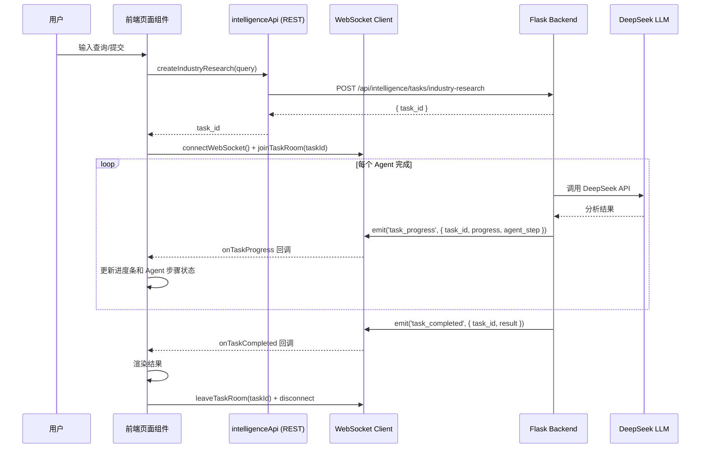
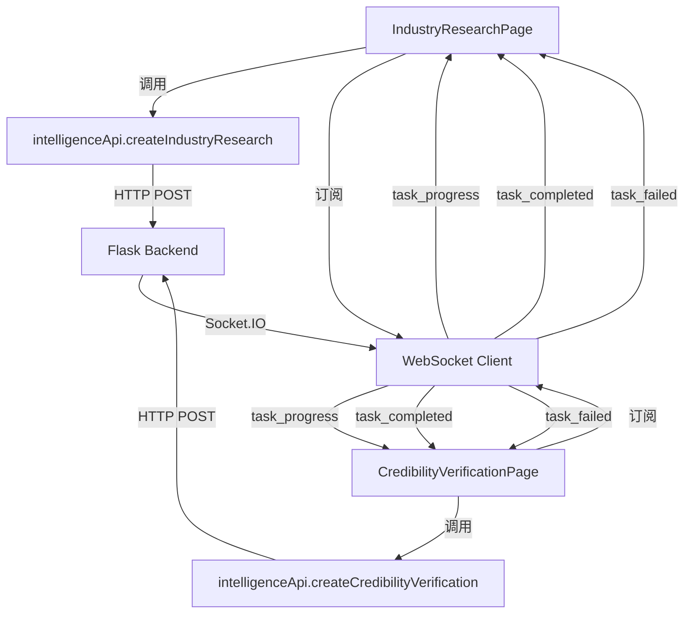

# 设计文档：真实服务集成（Real Service Integration）

## 概述

本设计将"快速行业认知"和"概念可信度验证"两个前端页面从 mock 实现切换为调用真实后端 REST API + WebSocket 实时进度。后端 API、应用层服务、LangGraph 工作流、WebSocket 推送器均已实现完毕，前端 API 服务层（`intelligenceApi.js`）也已就绪。核心工作集中在前端页面组件的改造：移除 mock 逻辑，接入真实 API 和 WebSocket。

### 关键发现

1. 后端 `IndustryInsight.to_dict()` 输出格式与前端 mock 数据格式高度一致（字段名完全匹配），前端结果渲染组件无需修改
2. 后端 `CredibilityReport.to_dict()` 输出格式与前端 mock 数据格式高度一致，前端结果渲染组件无需修改
3. `socket.io-client` 已在 `package.json` 中声明（v4.8.3）
4. Nginx 已配置 `/socket.io/` 的 WebSocket 代理
5. 后端 WebSocket 使用 `/intelligence` 命名空间
6. 后端 `task_progress` 事件数据格式：`{ task_id, progress, agent_step: { agent_name, status, started_at, completed_at, output_summary, error_message } }`
7. 后端 `task_completed` 事件数据格式：`{ task_id, result: { ... } }`
8. 后端 `task_failed` 事件数据格式：`{ task_id, error: string }`

## 架构

### 数据流



### 组件交互



## 组件与接口

### 1. IndustryResearchPage 改造

**改造范围**：`src/frontend/src/pages/IndustryResearchPage.jsx`

**移除内容**：
- `simulateTaskProgress()` 函数及其 `useCallback`
- `getMockResult()` 函数
- `handleSubmit` 中的 mock 任务创建逻辑

**新增内容**：
- 导入 `intelligenceApi` 和 WebSocket 工具函数
- `handleSubmit` 改为 `async` 函数，调用 `intelligenceApi.createIndustryResearch(query)`
- 使用 `useEffect` 管理 WebSocket 连接生命周期
- 订阅 `task_progress`、`task_completed`、`task_failed` 事件
- 组件卸载时清理 WebSocket 连接

**handleSubmit 伪代码**：
```javascript
const handleSubmit = async (value) => {
  const trimmedQuery = value?.trim() || query.trim();
  if (!trimmedQuery) return;
  
  setTaskStatus(TaskStatus.PENDING);
  setProgress(0);
  setAgentSteps([]);
  setResult(null);
  setError(null);

  try {
    const response = await intelligenceApi.createIndustryResearch(trimmedQuery);
    const newTaskId = response.data.task_id;
    setTaskId(newTaskId);
    setTaskStatus(TaskStatus.RUNNING);
    
    // 建立 WebSocket 连接并加入任务房间
    await connectWebSocket();
    joinTaskRoom(newTaskId);
  } catch (err) {
    setError(err.response?.data?.error || err.message || '创建任务失败');
    setTaskStatus(TaskStatus.FAILED);
  }
};
```

**WebSocket 事件处理伪代码**：
```javascript
// 在组件中使用 useEffect 管理 WebSocket 订阅
useEffect(() => {
  if (!taskId || taskStatus !== TaskStatus.RUNNING) return;
  
  const unsubProgress = onTaskProgress((data) => {
    if (data.task_id !== taskId) return;
    setProgress(data.progress);
    // 累积更新 agentSteps
    setAgentSteps(prev => {
      const updated = [...prev];
      const idx = updated.findIndex(s => s.agent_name === data.agent_step.agent_name);
      if (idx >= 0) updated[idx] = data.agent_step;
      else updated.push(data.agent_step);
      return updated;
    });
  });
  
  const unsubCompleted = onTaskCompleted((data) => {
    if (data.task_id !== taskId) return;
    setProgress(100);
    setResult(data.result);
    setTaskStatus(TaskStatus.COMPLETED);
    leaveTaskRoom(taskId);
  });
  
  const unsubFailed = onTaskFailed((data) => {
    if (data.task_id !== taskId) return;
    setError(data.error);
    setTaskStatus(TaskStatus.FAILED);
    leaveTaskRoom(taskId);
  });
  
  return () => { unsubProgress(); unsubCompleted(); unsubFailed(); };
}, [taskId, taskStatus]);
```

### 2. CredibilityVerificationPage 改造

**改造范围**：`src/frontend/src/pages/CredibilityVerificationPage.jsx`

改造模式与 IndustryResearchPage 完全一致，区别仅在于：
- 调用 `intelligenceApi.createCredibilityVerification(stockCode, concept)`
- Agent 步骤列表使用 `CREDIBILITY_AGENTS` 定义

### 3. WebSocket 事件扩展

**现有问题**：`intelligenceApi.js` 中已实现 `onTaskProgress` 和 `onTaskCompleted`，但缺少 `onTaskFailed` 的订阅函数。后端会推送 `task_failed` 事件。

**新增**：在 `intelligenceApi.js` 中添加 `task_failed` 事件的订阅支持：
- 在 `eventCallbacks` 中添加 `task_failed: []`
- 在 `connectWebSocket` 中添加 `socket.on('task_failed', ...)` 监听
- 导出 `onTaskFailed` 订阅函数

### 4. DeepSeek API 配置验证

**改造范围**：`src/backend/app.py` 的 `get_intelligence_service` 函数

**新增**：
- 当 `DEEPSEEK_API_KEY` 为空时，在日志中输出 WARNING 级别警告
- 在 `create_industry_research` 和 `create_credibility_verification` 端点中，如果 API key 未配置，返回 400 错误并提示用户配置

### 5. （可选）AKShare 数据源实现

**新增文件**：
- `src/backend/contexts/intelligence/infrastructure/data/akshare_news_provider.py` — 实现 `INewsDataProvider`
- `src/backend/contexts/intelligence/infrastructure/data/akshare_announcement_provider.py` — 实现 `IAnnouncementDataProvider`

**改造**：
- 在工作流 Agent 中注入数据提供者，将获取到的新闻/公告数据作为 LLM prompt 的上下文

## 数据模型

### 后端 → 前端数据格式映射

后端 `IndustryInsight.to_dict()` 输出与前端 mock 数据格式完全一致：

| 后端字段 | 前端 mock 字段 | 类型 | 说明 |
|---------|--------------|------|------|
| `industry_name` | `industry_name` | string | 行业名称 |
| `summary` | `summary` | string | 行业总结 |
| `industry_chain` | `industry_chain` | string | 产业链结构 |
| `technology_routes` | `technology_routes` | string[] | 技术路线 |
| `market_size` | `market_size` | string | 市场规模 |
| `top_stocks[].stock_code` | `top_stocks[].stock_code` | string | 股票代码 |
| `top_stocks[].stock_name` | `top_stocks[].stock_name` | string | 股票名称 |
| `top_stocks[].credibility_score` | `top_stocks[].credibility_score` | `{score, level}` | 可信度评分 |
| `top_stocks[].relevance_summary` | `top_stocks[].relevance_summary` | string | 相关性摘要 |
| `risk_alerts` | `risk_alerts` | string[] | 风险提示 |
| `catalysts` | `catalysts` | string[] | 催化剂 |
| `heat_score` | `heat_score` | int | 热度评分 |
| `competitive_landscape` | `competitive_landscape` | string | 竞争格局 |

后端 `CredibilityReport.to_dict()` 输出与前端 mock 数据格式完全一致：

| 后端字段 | 前端 mock 字段 | 类型 |
|---------|--------------|------|
| `stock_code` | `stock_code` | string |
| `stock_name` | `stock_name` | string |
| `concept` | `concept` | string |
| `overall_score` | `overall_score` | `{score, level}` |
| `main_business_match` | `main_business_match` | `{score, main_business_description, match_analysis}` |
| `evidence` | `evidence` | `{score, patents, orders, partnerships, analysis}` |
| `hype_history` | `hype_history` | `{score, past_concepts, analysis}` |
| `supply_chain_logic` | `supply_chain_logic` | `{score, upstream, downstream, analysis}` |
| `risk_labels` | `risk_labels` | string[] |
| `conclusion` | `conclusion` | string |

### WebSocket 事件数据格式

```typescript
// task_progress 事件
interface TaskProgressEvent {
  task_id: string;
  progress: number;       // 0-100
  agent_step: {
    agent_name: string;   // Agent 显示名称
    status: string;       // 'pending' | 'running' | 'completed' | 'failed' | 'skipped'
    started_at: string;   // ISO 时间
    completed_at: string; // ISO 时间
    output_summary: string;
    error_message: string | null;
  };
}

// task_completed 事件
interface TaskCompletedEvent {
  task_id: string;
  result: IndustryInsight | CredibilityReport;  // 完整结果对象
}

// task_failed 事件
interface TaskFailedEvent {
  task_id: string;
  error: string;
}
```


## 正确性属性（Correctness Properties）

*属性是系统在所有有效执行中应保持为真的特征或行为——本质上是关于系统应该做什么的形式化陈述。属性作为人类可读规范与机器可验证正确性保证之间的桥梁。*

### Property 1: 行业认知 API 调用正确性

*For any* 非空查询字符串，当用户在 IndustryResearchPage 提交查询时，组件应调用 `intelligenceApi.createIndustryResearch` 并传入该查询字符串，且成功后应将返回的 `task_id` 存储到组件状态中。

**Validates: Requirements 1.1**

### Property 2: 可信度验证 API 调用正确性

*For any* 有效的股票代码和非空概念字符串，当用户在 CredibilityVerificationPage 提交验证时，组件应调用 `intelligenceApi.createCredibilityVerification` 并传入正确的 `stockCode` 和 `concept` 参数，且成功后应将返回的 `task_id` 存储到组件状态中。

**Validates: Requirements 2.1**

### Property 3: API 错误处理一致性

*For any* API 错误响应（包含 `response.data.error` 或 `message` 字段），当任务创建失败时，页面组件应将任务状态设为 FAILED 并将错误信息存储到 `error` 状态中展示给用户。

**Validates: Requirements 1.3, 2.3**

### Property 4: WebSocket 进度事件处理

*For any* `task_progress` 事件（包含 `task_id`、`progress` 整数和 `agent_step` 对象），当事件的 `task_id` 与当前任务匹配时，页面组件应更新进度百分比为事件中的 `progress` 值，并将 `agent_step` 累积到 Agent 步骤列表中（已存在则更新，不存在则追加）。

**Validates: Requirements 3.3**

### Property 5: WebSocket 完成事件处理

*For any* `task_completed` 事件（包含 `task_id` 和 `result` 对象），当事件的 `task_id` 与当前任务匹配时，页面组件应将进度设为 100、将任务状态设为 COMPLETED、并将 `result` 存储为结果数据。

**Validates: Requirements 3.4**

### Property 6: WebSocket 失败事件处理

*For any* `task_failed` 事件（包含 `task_id` 和 `error` 字符串），当事件的 `task_id` 与当前任务匹配时，页面组件应将任务状态设为 FAILED 并将 `error` 存储到错误状态中。

**Validates: Requirements 3.5**

### Property 7: 外部数据上下文注入

*For any* 工作流 Agent 执行，当外部数据提供者（INewsDataProvider 或 IAnnouncementDataProvider）返回非空数据时，Agent 构建的 LLM prompt 应包含该外部数据作为上下文信息。

**Validates: Requirements 5.3, 5.4**

## 错误处理

### 前端错误处理

| 错误场景 | 处理方式 |
|---------|---------|
| API 调用网络错误 | 设置 FAILED 状态，展示 "网络连接失败，请检查网络后重试" |
| API 返回 400 错误 | 设置 FAILED 状态，展示后端返回的 `error` 字段内容 |
| API 返回 500 错误 | 设置 FAILED 状态，展示 "服务器内部错误，请稍后重试" |
| WebSocket 连接失败 | 展示连接状态提示，Socket.IO 自动重连（最多 5 次） |
| WebSocket 断开 | 展示断开提示，Socket.IO 自动重连 |
| `task_failed` 事件 | 设置 FAILED 状态，展示后端返回的错误信息 |

### 后端错误处理

| 错误场景 | 处理方式 |
|---------|---------|
| DEEPSEEK_API_KEY 未配置 | 启动时 WARNING 日志；API 调用时返回 400 + 明确错误提示 |
| DeepSeek API 调用失败 | Agent 重试机制（已实现），重试耗尽后降级返回 |
| AKShare 数据获取失败 | 降级为仅使用 LLM 知识，日志记录 WARNING |

## 测试策略

### 测试框架

- 前端：使用项目现有的测试设置（如有），或推荐 Vitest + React Testing Library
- 后端：使用项目现有的 pytest 框架
- 属性测试库：前端使用 fast-check，后端使用 hypothesis

### 单元测试

1. **IndustryResearchPage 组件测试**
   - 测试提交查询后调用正确的 API
   - 测试 API 错误时展示错误信息
   - 测试 WebSocket 事件更新组件状态

2. **CredibilityVerificationPage 组件测试**
   - 测试提交验证后调用正确的 API
   - 测试 API 错误时展示错误信息
   - 测试 WebSocket 事件更新组件状态

3. **WebSocket 事件处理测试**
   - 测试 `onTaskFailed` 订阅和取消订阅
   - 测试事件过滤（只处理匹配 task_id 的事件）

4. **DeepSeek API 配置验证测试**
   - 测试 API key 为空时的警告日志
   - 测试 API key 为空时的错误响应

### 属性测试

每个属性测试应运行至少 100 次迭代，使用随机生成的输入数据。

- **Property 1-2**: 生成随机查询字符串/股票代码+概念，验证 API 调用参数正确性
- **Property 3**: 生成随机错误响应对象，验证错误处理一致性
- **Property 4**: 生成随机 progress 事件数据，验证状态更新正确性
- **Property 5-6**: 生成随机 completed/failed 事件数据，验证状态转换正确性
- **Property 7**: 生成随机新闻/公告数据，验证 prompt 包含外部数据

### 测试标签格式

每个属性测试应包含注释标签：
```
Feature: real-service-integration, Property {number}: {property_text}
```
