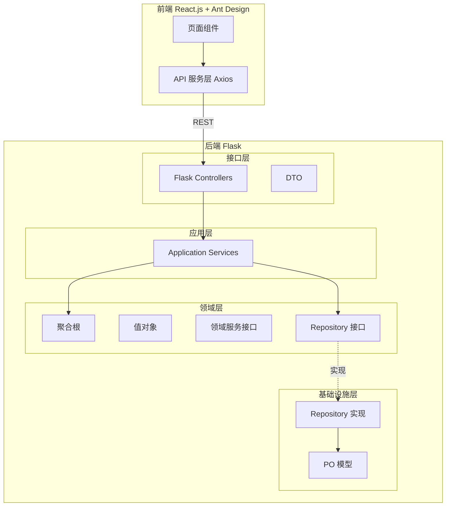
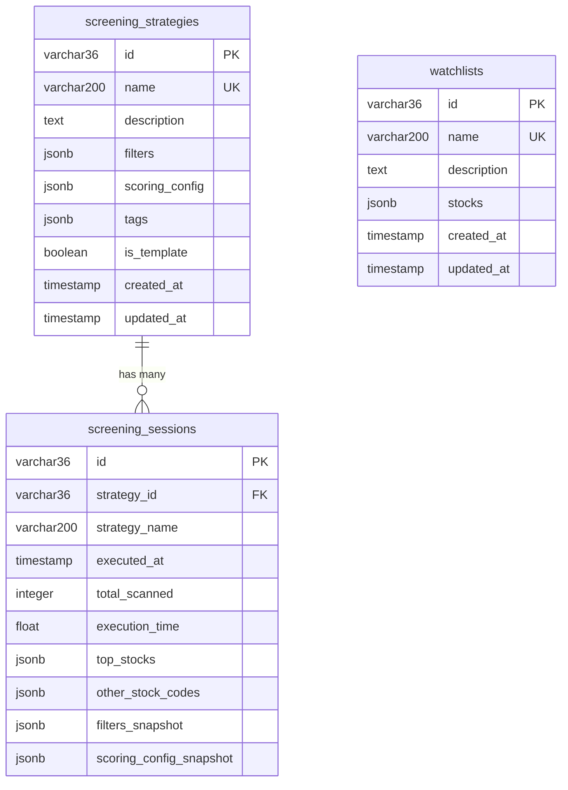

# 设计文档：股票投研工作流定制化平台 - Stock Screening Context MVP

## 概述

本设计文档描述 Stock Screening Context MVP 的完整技术实现方案。系统采用 DDD 四层架构（接口层、应用层、领域层、基础设施层），后端使用 Python Flask + SQLAlchemy + PostgreSQL，前端使用 React.js + Vite + Ant Design，前后端通过 RESTful API 交互。

核心设计原则：
- 依赖倒置：领域层定义接口，基础设施层实现
- 领域层零技术依赖：纯 Python，不导入 Flask/SQLAlchemy
- PO + Repository + DAO 模式实现持久化
- FilterGroup 使用 JSONB 存储以支持递归嵌套

## 架构

### 整体架构



### 依赖方向

Interface Layer -> Application Layer -> Domain Layer <- Infrastructure Layer

领域层是核心，不依赖任何外层。基础设施层实现领域层定义的接口。

### 项目目录结构

```
src/
├── shared_kernel/                          # 共享内核
│   ├── __init__.py
│   ├── value_objects/
│   │   ├── __init__.py
│   │   └── stock_code.py                  # StockCode 值对象
│   └── interfaces/
│       ├── __init__.py
│       └── market_data_repository.py       # IMarketDataRepository 接口
├── contexts/                               # 限界上下文
│   └── screening/                          # 筛选上下文
│       ├── __init__.py
│       ├── interface/                      # 接口层
│       │   ├── controllers/
│       │   │   ├── strategy_controller.py
│       │   │   ├── session_controller.py
│       │   │   └── watchlist_controller.py
│       │   └── dto/
│       │       ├── strategy_dto.py
│       │       ├── session_dto.py
│       │       └── watchlist_dto.py
│       ├── application/                    # 应用层
│       │   └── services/
│       │       ├── screening_strategy_service.py
│       │       └── watchlist_service.py
│       ├── domain/                         # 领域层
│       │   ├── models/
│       │   │   ├── screening_strategy.py   # 聚合根
│       │   │   ├── screening_session.py    # 聚合根
│       │   │   ├── watchlist.py            # 聚合根
│       │   │   ├── filter_group.py         # 实体
│       │   │   └── stock.py                # 实体
│       │   ├── value_objects/
│       │   │   ├── filter_condition.py
│       │   │   ├── indicator_value.py
│       │   │   ├── scoring_config.py
│       │   │   ├── screening_result.py
│       │   │   ├── scored_stock.py
│       │   │   ├── watched_stock.py
│       │   │   └── identifiers.py
│       │   ├── enums/
│       │   │   ├── indicator_field.py
│       │   │   ├── comparison_operator.py
│       │   │   └── enums.py                # LogicalOperator 等
│       │   ├── services/
│       │   │   ├── scoring_service.py      # IScoringService 接口
│       │   │   └── indicator_calculation_service.py
│       │   ├── repositories/
│       │   │   ├── screening_strategy_repository.py
│       │   │   ├── screening_session_repository.py
│       │   │   ├── watchlist_repository.py
│       │   │   └── historical_data_provider.py
│       │   └── exceptions.py               # 领域异常
│       └── infrastructure/                 # 基础设施层
│           ├── persistence/
│           │   ├── models/                 # PO 模型
│           │   │   ├── screening_strategy_po.py
│           │   │   ├── screening_session_po.py
│           │   │   └── watchlist_po.py
│           │   └── repositories/           # Repository 实现
│           │       ├── screening_strategy_repository_impl.py
│           │       ├── screening_session_repository_impl.py
│           │       └── watchlist_repository_impl.py
│           └── services/                   # 领域服务实现
│               ├── scoring_service_impl.py
│               └── indicator_calculation_service_impl.py
├── frontend/                               # React 前端
│   ├── package.json
│   ├── vite.config.js
│   ├── index.html
│   └── src/
│       ├── main.jsx
│       ├── App.jsx
│       ├── layouts/
│       │   └── MainLayout.jsx
│       ├── pages/
│       │   ├── StrategyListPage.jsx
│       │   ├── StrategyCreatePage.jsx
│       │   └── ScreeningResultPage.jsx
│       ├── components/
│       │   ├── FilterConditionBuilder.jsx
│       │   └── ScoredStockTable.jsx
│       └── services/
│           └── api.js
├── tests/
│   ├── unit/
│   │   └── domain/
│   ├── integration/
│   └── property/
├── app.py                                  # Flask 入口
├── config.py                               # 配置管理
├── docker-compose.yml
├── requirements.txt
└── README.md
```

## 组件与接口

### 共享内核（Shared Kernel）

#### StockCode 值对象

```python
import re

class StockCode:
    """A股代码值对象
    格式：6位数字 + .SH 或 .SZ
    沪市：600xxx.SH, 601xxx.SH, 603xxx.SH, 688xxx.SH
    深市：000xxx.SZ, 001xxx.SZ, 002xxx.SZ, 300xxx.SZ
    """
    VALID_PATTERN = r'^\d{6}\.(SH|SZ)$'

    def __init__(self, code: str):
        if not re.match(self.VALID_PATTERN, code):
            raise ValueError(f"无效的股票代码格式: {code}")
        self._code = code

    @property
    def code(self) -> str:
        return self._code

    @property
    def exchange(self) -> str:
        return self._code.split('.')[1]

    @property
    def numeric_code(self) -> str:
        return self._code.split('.')[0]

    def __eq__(self, other):
        return isinstance(other, StockCode) and self._code == other._code

    def __hash__(self):
        return hash(self._code)

    def __repr__(self):
        return f"StockCode('{self._code}')"
```

#### IMarketDataRepository 接口

```python
from abc import ABC, abstractmethod
from typing import TypeVar, Generic, List, Optional
from datetime import datetime

TStock = TypeVar('TStock')

class IMarketDataRepository(ABC, Generic[TStock]):
    @abstractmethod
    def get_all_stock_codes(self) -> List['StockCode']: ...

    @abstractmethod
    def get_stock(self, stock_code: 'StockCode') -> Optional[TStock]: ...

    @abstractmethod
    def get_stocks_by_codes(self, stock_codes: List['StockCode']) -> List[TStock]: ...

    @abstractmethod
    def get_last_update_time(self) -> datetime: ...

    @abstractmethod
    def get_available_industries(self) -> List[str]: ...
```

### 领域层组件

#### 枚举设计

IndicatorField 使用 Python Enum，每个成员携带元数据：

```python
class IndicatorField(Enum):
    ROE = ("净资产收益率", IndicatorCategory.BASIC, ValueType.NUMERIC)
    PE = ("市盈率", IndicatorCategory.BASIC, ValueType.NUMERIC)
    PB = ("市净率", IndicatorCategory.BASIC, ValueType.NUMERIC)
    # ... 其他基础、时间序列、衍生指标

    def __init__(self, display_name, category, value_type):
        self.display_name = display_name
        self.category = category
        self.value_type = value_type
```

ComparisonOperator 枚举内置 apply 方法：

```python
class ComparisonOperator(Enum):
    GREATER_THAN = ">"
    LESS_THAN = "<"
    EQUALS = "="
    GREATER_OR_EQUAL = ">="
    LESS_OR_EQUAL = "<="
    NOT_EQUALS = "!="
    IN = "in"
    NOT_IN = "not_in"
    BETWEEN = "between"
    NOT_BETWEEN = "not_between"

    def apply(self, actual, expected: 'IndicatorValue') -> bool:
        if self == ComparisonOperator.GREATER_THAN:
            return actual > expected.to_comparable()
        elif self == ComparisonOperator.IN:
            return actual in expected.to_comparable()
        elif self == ComparisonOperator.BETWEEN:
            min_val, max_val = expected.to_comparable()
            return min_val <= actual <= max_val
        # ... 其他运算符
```

#### IndicatorValue Tagged Union

```python
from abc import ABC, abstractmethod
import math

class IndicatorValue(ABC):
    @abstractmethod
    def to_comparable(self): ...

    @abstractmethod
    def to_dict(self) -> dict: ...

    @classmethod
    def factory_from_dict(cls, data: dict) -> 'IndicatorValue':
        type_map = {
            'numeric': NumericValue,
            'text': TextValue,
            'list': ListValue,
            'range': RangeValue,
            'time_series': TimeSeriesValue,
        }
        return type_map[data['type']].from_dict(data)

class NumericValue(IndicatorValue):
    def __init__(self, value: float, unit: str = None):
        if math.isnan(value) or math.isinf(value):
            raise ValueError("值不能是 NaN 或 Infinity")
        self._value = value
        self._unit = unit

    def to_comparable(self):
        return self._value

    def to_dict(self):
        return {'type': 'numeric', 'value': self._value, 'unit': self._unit}

    @classmethod
    def from_dict(cls, data):
        return cls(value=data['value'], unit=data.get('unit'))

class TextValue(IndicatorValue):
    def __init__(self, value: str):
        self._value = value

    def to_comparable(self):
        return self._value

    def to_dict(self):
        return {'type': 'text', 'value': self._value}

    @classmethod
    def from_dict(cls, data):
        return cls(value=data['value'])

class ListValue(IndicatorValue):
    def __init__(self, values: list):
        self._values = values

    def to_comparable(self):
        return self._values

    def to_dict(self):
        return {'type': 'list', 'values': self._values}

    @classmethod
    def from_dict(cls, data):
        return cls(values=data['values'])

class RangeValue(IndicatorValue):
    def __init__(self, min_val: float, max_val: float):
        if min_val > max_val:
            raise ValueError("min 不能大于 max")
        self._min = min_val
        self._max = max_val

    def to_comparable(self):
        return (self._min, self._max)

    def to_dict(self):
        return {'type': 'range', 'min': self._min, 'max': self._max}

    @classmethod
    def from_dict(cls, data):
        return cls(min_val=data['min'], max_val=data['max'])

class TimeSeriesValue(IndicatorValue):
    def __init__(self, years: int, threshold: float = None):
        self._years = years
        self._threshold = threshold

    def to_comparable(self):
        return {'years': self._years, 'threshold': self._threshold}

    def to_dict(self):
        return {'type': 'time_series', 'years': self._years, 'threshold': self._threshold}

    @classmethod
    def from_dict(cls, data):
        return cls(years=data['years'], threshold=data.get('threshold'))
```

#### FilterCondition 值对象

```python
class FilterCondition:
    def __init__(self, field: IndicatorField, operator: ComparisonOperator,
                 value: IndicatorValue):
        self._validate_type_match(field, operator, value)
        self._field = field
        self._operator = operator
        self._value = value

    def _validate_type_match(self, field, operator, value):
        if field.value_type == ValueType.NUMERIC and not isinstance(value, (NumericValue, RangeValue, TimeSeriesValue)):
            raise TypeError(f"字段 {field.name} 需要数值类型的值")
        if field.value_type == ValueType.TEXT and not isinstance(value, (TextValue, ListValue)):
            raise TypeError(f"字段 {field.name} 需要文本类型的值")
        if operator in (ComparisonOperator.IN, ComparisonOperator.NOT_IN) and not isinstance(value, ListValue):
            raise ValueError(f"运算符 {operator.value} 需要 ListValue")
        if operator in (ComparisonOperator.BETWEEN, ComparisonOperator.NOT_BETWEEN) and not isinstance(value, RangeValue):
            raise ValueError(f"运算符 {operator.value} 需要 RangeValue")

    def evaluate(self, stock, calc_service) -> bool:
        actual = calc_service.calculate_indicator(self._field, stock)
        if actual is None:
            return False
        return self._operator.apply(actual, self._value)

    def to_dict(self) -> dict:
        return {
            'field': self._field.name,
            'operator': self._operator.value,
            'value': self._value.to_dict()
        }

    @classmethod
    def from_dict(cls, data: dict) -> 'FilterCondition':
        field = IndicatorField[data['field']]
        operator = ComparisonOperator(data['operator'])
        value = IndicatorValue.factory_from_dict(data['value'])
        return cls(field=field, operator=operator, value=value)

    def __eq__(self, other):
        return (isinstance(other, FilterCondition) and
                self._field == other._field and
                self._operator == other._operator and
                self._value.to_dict() == other._value.to_dict())

    def __hash__(self):
        return hash((self._field, self._operator, str(self._value.to_dict())))
```

#### FilterGroup 实体

```python
import uuid

class FilterGroup:
    def __init__(self, group_id: str, operator: LogicalOperator,
                 conditions: list = None, sub_groups: list = None):
        self._group_id = group_id
        self._operator = operator
        self._conditions = conditions or []
        self._sub_groups = sub_groups or []

    def match(self, stock, calc_service) -> bool:
        results = []
        for cond in self._conditions:
            results.append(cond.evaluate(stock, calc_service))
        for group in self._sub_groups:
            results.append(group.match(stock, calc_service))

        if not results:
            return self._operator != LogicalOperator.OR

        if self._operator == LogicalOperator.AND:
            return all(results)
        elif self._operator == LogicalOperator.OR:
            return any(results)
        elif self._operator == LogicalOperator.NOT:
            return not results[0]

    def has_any_condition(self) -> bool:
        if self._conditions:
            return True
        return any(g.has_any_condition() for g in self._sub_groups)

    def count_total_conditions(self) -> int:
        count = len(self._conditions)
        for g in self._sub_groups:
            count += g.count_total_conditions()
        return count

    def to_dict(self) -> dict:
        return {
            'group_id': self._group_id,
            'operator': self._operator.value,
            'conditions': [c.to_dict() for c in self._conditions],
            'sub_groups': [g.to_dict() for g in self._sub_groups]
        }

    @classmethod
    def from_dict(cls, data: dict) -> 'FilterGroup':
        return cls(
            group_id=data.get('group_id', str(uuid.uuid4())),
            operator=LogicalOperator(data['operator']),
            conditions=[FilterCondition.from_dict(c) for c in data.get('conditions', [])],
            sub_groups=[FilterGroup.from_dict(g) for g in data.get('sub_groups', [])]
        )
```

#### ScreeningStrategy 聚合根

```python
import time as time_module
from datetime import datetime

class ScreeningStrategy:
    def __init__(self, strategy_id, name, filters, scoring_config,
                 description=None, tags=None, is_template=False,
                 created_at=None, updated_at=None):
        if not name or not name.strip():
            raise ValueError("策略名称不能为空")
        if not filters.has_any_condition():
            raise ValueError("筛选条件不能为空")
        self._strategy_id = strategy_id
        self._name = name
        self._description = description
        self._filters = filters
        self._scoring_config = scoring_config
        self._tags = tags or []
        self._is_template = is_template
        self._created_at = created_at or datetime.utcnow()
        self._updated_at = updated_at or datetime.utcnow()

    def execute(self, candidate_stocks, scoring_service, calc_service):
        start = time_module.time()
        matched = [s for s in candidate_stocks
                   if self._filters.match(s, calc_service)]
        scored = scoring_service.score_stocks(matched, self._scoring_config, calc_service)
        scored.sort(key=lambda s: s.score, reverse=True)
        execution_time = time_module.time() - start
        return ScreeningResult(
            matched_stocks=scored,
            total_scanned=len(candidate_stocks),
            execution_time=execution_time,
            filters_applied=self._filters,
            scoring_config=self._scoring_config
        )

    # 属性访问器
    @property
    def strategy_id(self): return self._strategy_id
    @property
    def name(self): return self._name
    @property
    def filters(self): return self._filters
    @property
    def scoring_config(self): return self._scoring_config
    @property
    def tags(self): return self._tags
    @property
    def is_template(self): return self._is_template
    @property
    def created_at(self): return self._created_at
    @property
    def updated_at(self): return self._updated_at
    @property
    def description(self): return self._description
```

#### WatchList 聚合根

```python
class WatchList:
    def __init__(self, watchlist_id, name, description=None,
                 stocks=None, created_at=None, updated_at=None):
        if not name or not name.strip():
            raise ValueError("自选股列表名称不能为空")
        self._watchlist_id = watchlist_id
        self._name = name
        self._description = description
        self._stocks = stocks or []
        self._created_at = created_at or datetime.utcnow()
        self._updated_at = updated_at or datetime.utcnow()

    def add_stock(self, stock_code, stock_name, note=None, tags=None):
        if self.contains(stock_code):
            raise DuplicateStockError(f"股票 {stock_code} 已存在于列表中")
        watched = WatchedStock(stock_code=stock_code, stock_name=stock_name,
                               added_at=datetime.utcnow(), note=note, tags=tags)
        self._stocks.append(watched)
        self._updated_at = datetime.utcnow()

    def remove_stock(self, stock_code):
        if not self.contains(stock_code):
            raise StockNotFoundError(f"股票 {stock_code} 不在列表中")
        self._stocks = [s for s in self._stocks if s.stock_code != stock_code]
        self._updated_at = datetime.utcnow()

    def contains(self, stock_code) -> bool:
        return any(s.stock_code == stock_code for s in self._stocks)
```

### 基础设施层组件

#### PO 模型（SQLAlchemy）

```python
from sqlalchemy import Column, String, Text, Boolean, DateTime, Integer, Float
from sqlalchemy.dialects.postgresql import JSONB
from flask_sqlalchemy import SQLAlchemy

db = SQLAlchemy()

class ScreeningStrategyPO(db.Model):
    __tablename__ = 'screening_strategies'
    id = Column(String(36), primary_key=True)
    name = Column(String(200), nullable=False, unique=True)
    description = Column(Text, nullable=True)
    filters = Column(JSONB, nullable=False)
    scoring_config = Column(JSONB, nullable=False)
    tags = Column(JSONB, default=[])
    is_template = Column(Boolean, default=False)
    created_at = Column(DateTime, nullable=False)
    updated_at = Column(DateTime, nullable=False)

class ScreeningSessionPO(db.Model):
    __tablename__ = 'screening_sessions'
    id = Column(String(36), primary_key=True)
    strategy_id = Column(String(36), nullable=False, index=True)
    strategy_name = Column(String(200), nullable=False)
    executed_at = Column(DateTime, nullable=False, index=True)
    total_scanned = Column(Integer, nullable=False)
    execution_time = Column(Float, nullable=False)
    top_stocks = Column(JSONB, nullable=False)
    other_stock_codes = Column(JSONB, default=[])
    filters_snapshot = Column(JSONB, nullable=False)
    scoring_config_snapshot = Column(JSONB, nullable=False)

class WatchListPO(db.Model):
    __tablename__ = 'watchlists'
    id = Column(String(36), primary_key=True)
    name = Column(String(200), nullable=False, unique=True)
    description = Column(Text, nullable=True)
    stocks = Column(JSONB, default=[])
    created_at = Column(DateTime, nullable=False)
    updated_at = Column(DateTime, nullable=False)
```

#### Repository 实现

```python
class ScreeningStrategyRepositoryImpl(IScreeningStrategyRepository):
    def __init__(self, session):
        self._session = session

    def save(self, strategy):
        po = self._to_po(strategy)
        self._session.merge(po)
        self._session.flush()

    def find_by_id(self, strategy_id):
        po = self._session.query(ScreeningStrategyPO).get(strategy_id.value)
        return self._to_domain(po) if po else None

    def find_by_name(self, name):
        po = self._session.query(ScreeningStrategyPO).filter_by(name=name).first()
        return self._to_domain(po) if po else None

    def find_all(self, limit=100, offset=0):
        pos = (self._session.query(ScreeningStrategyPO)
               .order_by(ScreeningStrategyPO.updated_at.desc())
               .offset(offset).limit(limit).all())
        return [self._to_domain(po) for po in pos]

    def delete(self, strategy_id):
        po = self._session.query(ScreeningStrategyPO).get(strategy_id.value)
        if po:
            self._session.delete(po)
            self._session.flush()

    def _to_po(self, strategy):
        return ScreeningStrategyPO(
            id=strategy.strategy_id.value,
            name=strategy.name,
            description=strategy.description,
            filters=strategy.filters.to_dict(),
            scoring_config=strategy.scoring_config.to_dict(),
            tags=strategy.tags,
            is_template=strategy.is_template,
            created_at=strategy.created_at,
            updated_at=strategy.updated_at
        )

    def _to_domain(self, po):
        return ScreeningStrategy(
            strategy_id=StrategyId.from_string(po.id),
            name=po.name,
            description=po.description,
            filters=FilterGroup.from_dict(po.filters),
            scoring_config=ScoringConfig.from_dict(po.scoring_config),
            tags=po.tags or [],
            is_template=po.is_template,
            created_at=po.created_at,
            updated_at=po.updated_at
        )
```

### 应用层组件

```python
class ScreeningStrategyService:
    def __init__(self, strategy_repo, session_repo,
                 market_data_repo, scoring_service, calc_service):
        self._strategy_repo = strategy_repo
        self._session_repo = session_repo
        self._market_data_repo = market_data_repo
        self._scoring_service = scoring_service
        self._calc_service = calc_service

    def create_strategy(self, name, filters_dict, scoring_config_dict,
                        description=None, tags=None):
        if self._strategy_repo.find_by_name(name):
            raise DuplicateNameError(f"策略名称 '{name}' 已存在")
        strategy = ScreeningStrategy(
            strategy_id=StrategyId.generate(),
            name=name,
            filters=FilterGroup.from_dict(filters_dict),
            scoring_config=ScoringConfig.from_dict(scoring_config_dict),
            description=description,
            tags=tags
        )
        self._strategy_repo.save(strategy)
        return strategy

    def execute_strategy(self, strategy_id_str):
        strategy = self._strategy_repo.find_by_id(
            StrategyId.from_string(strategy_id_str))
        if not strategy:
            raise StrategyNotFoundError(f"策略 {strategy_id_str} 不存在")
        stock_codes = self._market_data_repo.get_all_stock_codes()
        stocks = self._market_data_repo.get_stocks_by_codes(stock_codes)
        result = strategy.execute(stocks, self._scoring_service, self._calc_service)
        session = ScreeningSession.create_from_result(
            strategy_id=strategy.strategy_id,
            strategy_name=strategy.name,
            result=result
        )
        self._session_repo.save(session)
        return result

class WatchListService:
    def __init__(self, watchlist_repo):
        self._watchlist_repo = watchlist_repo

    def create_watchlist(self, name, description=None):
        if self._watchlist_repo.find_by_name(name):
            raise DuplicateNameError(f"自选股列表 '{name}' 已存在")
        watchlist = WatchList(
            watchlist_id=WatchListId.generate(),
            name=name,
            description=description
        )
        self._watchlist_repo.save(watchlist)
        return watchlist

    def add_stock(self, watchlist_id_str, stock_code_str, stock_name, note=None, tags=None):
        watchlist = self._watchlist_repo.find_by_id(
            WatchListId.from_string(watchlist_id_str))
        if not watchlist:
            raise WatchListNotFoundError(...)
        watchlist.add_stock(StockCode(stock_code_str), stock_name, note, tags)
        self._watchlist_repo.save(watchlist)
```

### 接口层组件

#### Flask Controller

```python
from flask import Blueprint, request, jsonify

strategy_bp = Blueprint('screening_strategies', __name__,
                         url_prefix='/api/screening/strategies')

@strategy_bp.route('', methods=['POST'])
def create_strategy():
    data = request.get_json()
    dto = CreateStrategyRequest.from_dict(data)
    strategy = strategy_service.create_strategy(
        name=dto.name, filters_dict=dto.filters,
        scoring_config_dict=dto.scoring_config,
        description=dto.description, tags=dto.tags
    )
    return jsonify(StrategyResponse.from_domain(strategy).to_dict()), 201

@strategy_bp.route('', methods=['GET'])
def list_strategies():
    limit = request.args.get('limit', 100, type=int)
    offset = request.args.get('offset', 0, type=int)
    strategies = strategy_service.list_strategies(limit, offset)
    return jsonify([StrategyResponse.from_domain(s).to_dict() for s in strategies])

@strategy_bp.route('/<strategy_id>', methods=['GET'])
def get_strategy(strategy_id):
    strategy = strategy_service.get_strategy(strategy_id)
    if not strategy:
        return jsonify({'error': '策略不存在'}), 404
    return jsonify(StrategyResponse.from_domain(strategy).to_dict())

@strategy_bp.route('/<strategy_id>/execute', methods=['POST'])
def execute_strategy(strategy_id):
    result = strategy_service.execute_strategy(strategy_id)
    return jsonify(ScreeningResultResponse.from_domain(result).to_dict())
```

### 前端组件

#### API 服务层

```javascript
import axios from 'axios';

const apiClient = axios.create({
  baseURL: '/api',
  headers: { 'Content-Type': 'application/json' }
});

export const screeningApi = {
  getStrategies: (params) => apiClient.get('/screening/strategies', { params }),
  getStrategy: (id) => apiClient.get(`/screening/strategies/${id}`),
  createStrategy: (data) => apiClient.post('/screening/strategies', data),
  updateStrategy: (id, data) => apiClient.put(`/screening/strategies/${id}`, data),
  deleteStrategy: (id) => apiClient.delete(`/screening/strategies/${id}`),
  executeStrategy: (id) => apiClient.post(`/screening/strategies/${id}/execute`),
  getSessions: (params) => apiClient.get('/screening/sessions', { params }),
  getSession: (id) => apiClient.get(`/screening/sessions/${id}`),
  getWatchlists: () => apiClient.get('/screening/watchlists'),
  createWatchlist: (data) => apiClient.post('/screening/watchlists', data),
  addStock: (id, data) => apiClient.post(`/screening/watchlists/${id}/stocks`, data),
  removeStock: (id, code) =>
    apiClient.delete(`/screening/watchlists/${id}/stocks/${code}`)
};
```

## 数据模型

### PostgreSQL 表结构



### JSONB 存储格式

FilterGroup 序列化格式：
```json
{
  "group_id": "uuid-string",
  "operator": "AND",
  "conditions": [
    {"field": "ROE", "operator": ">", "value": {"type": "numeric", "value": 0.15}}
  ],
  "sub_groups": []
}
```

ScoringConfig 序列化格式：
```json
{
  "weights": {"ROE": 0.3, "PE": 0.2, "REVENUE_CAGR_3Y": 0.5},
  "normalization_method": "min_max"
}
```

## 正确性属性

*正确性属性是系统在所有有效执行中都应保持为真的特征或行为——本质上是关于系统应该做什么的形式化陈述。属性是人类可读规范与机器可验证正确性保证之间的桥梁。*

以下属性基于需求文档中的验收标准推导而来，每个属性都包含明确的"对于所有"量化语句，并将通过属性基测试（Property-Based Testing）进行验证。

### Property 1: StockCode 格式验证一致性

*对于任意*字符串 s，如果 s 匹配正则表达式 `^\d{6}\.(SH|SZ)$`，则 `StockCode(s)` 应成功构造；如果 s 不匹配该模式，则 `StockCode(s)` 应抛出 ValueError。

**Validates: Requirements 1.3, 1.5**

### Property 2: WatchList 不允许重复添加

*对于任意* WatchList 和任意 StockCode，如果该 StockCode 已存在于 WatchList 中，则再次调用 `add_stock()` 应抛出 `DuplicateStockError`，且 WatchList 的股票数量保持不变。

**Validates: Requirements 2.8**

### Property 3: WatchList 移除不存在的股票应报错

*对于任意* WatchList 和任意 StockCode，如果该 StockCode 不在 WatchList 中，则调用 `remove_stock()` 应抛出 `StockNotFoundError`，且 WatchList 的股票数量保持不变。

**Validates: Requirements 2.9**

### Property 4: ScoringConfig 权重之和约束

*对于任意*一组 IndicatorField 到 float 的映射 weights，如果 `sum(weights.values())` 不等于 1.0（在浮点精度容差内），则构造 `ScoringConfig` 应抛出验证错误。

**Validates: Requirements 3.8**

### Property 5: FilterCondition 类型匹配约束

*对于任意* IndicatorField 和 IndicatorValue 的组合，如果 field 的 value_type 是 NUMERIC 但 value 是 TextValue 或 ListValue，则构造 `FilterCondition` 应抛出 TypeError。反之，如果 field 的 value_type 是 TEXT 但 value 是 NumericValue 或 RangeValue，也应抛出 TypeError。

**Validates: Requirements 3.9**

### Property 6: FilterCondition 序列化 round-trip

*对于任意*有效的 FilterCondition 对象，调用 `to_dict()` 然后 `from_dict()` 应产生一个与原始对象等价的 FilterCondition。

**Validates: Requirements 3.11**

### Property 7: FilterGroup 序列化 round-trip

*对于任意*有效的 FilterGroup 对象（包括递归嵌套的子组），调用 `to_dict()` 然后 `from_dict()` 应产生一个与原始对象等价的 FilterGroup，保留所有嵌套结构。

**Validates: Requirements 3.12**

### Property 8: ComparisonOperator.apply 与原生运算符一致

*对于任意*数值 actual 和 expected，`ComparisonOperator.GREATER_THAN.apply(actual, NumericValue(expected))` 应等于 `actual > expected`；`ComparisonOperator.BETWEEN.apply(actual, RangeValue(min, max))` 应等于 `min <= actual <= max`；`ComparisonOperator.IN.apply(actual, ListValue(values))` 应等于 `actual in values`。所有比较运算符的 apply 结果应与对应的 Python 原生运算符结果一致。

**Validates: Requirements 4.6, 4.7, 4.8**

### Property 9: FilterGroup.match 逻辑语义一致性

*对于任意* FilterGroup、Stock 和 calc_service，当 operator 为 AND 时，match 结果应等于所有子条件结果的逻辑与；当 operator 为 OR 时，应等于逻辑或；当 operator 为 NOT 时，应等于单个子元素结果的取反。

**Validates: Requirements 5.3, 5.4, 5.5**

### Property 10: ScreeningStrategy.execute 结果有序性

*对于任意* ScreeningStrategy 和候选股票列表，execute() 返回的 ScreeningResult 中的 matched_stocks 应按 score 降序排列，且所有 matched_stocks 中的股票都应满足策略的筛选条件。

**Validates: Requirements 5.6**

## 错误处理

### 领域层异常

```python
# contexts/screening/domain/exceptions.py

class DomainError(Exception):
    """领域层基础异常"""
    pass

class DuplicateStockError(DomainError):
    """WatchList 中添加重复股票"""
    pass

class StockNotFoundError(DomainError):
    """WatchList 中移除不存在的股票"""
    pass

class DuplicateNameError(DomainError):
    """策略或列表名称重复"""
    pass

class StrategyNotFoundError(DomainError):
    """策略不存在"""
    pass

class WatchListNotFoundError(DomainError):
    """自选股列表不存在"""
    pass

class ScoringError(DomainError):
    """评分计算错误"""
    pass

class IndicatorCalculationError(DomainError):
    """指标计算错误"""
    pass

class ValidationError(DomainError):
    """通用验证错误"""
    pass
```

### 接口层错误处理

Flask 全局错误处理器将领域异常映射为 HTTP 状态码：

| 领域异常 | HTTP 状态码 | 说明 |
|---------|-----------|------|
| ValidationError | 400 | 请求数据验证失败 |
| DuplicateNameError | 409 | 名称冲突 |
| StrategyNotFoundError | 404 | 策略不存在 |
| WatchListNotFoundError | 404 | 自选股列表不存在 |
| StockNotFoundError | 404 | 股票不存在 |
| DuplicateStockError | 409 | 股票已存在 |
| ScoringError | 500 | 内部评分错误 |

```python
@app.errorhandler(DomainError)
def handle_domain_error(error):
    status_map = {
        ValidationError: 400,
        DuplicateNameError: 409,
        StrategyNotFoundError: 404,
        WatchListNotFoundError: 404,
        StockNotFoundError: 404,
        DuplicateStockError: 409,
    }
    status = status_map.get(type(error), 500)
    return jsonify({'error': str(error)}), status
```

## 测试策略

### 测试框架选择

- 单元测试：pytest
- 属性基测试：hypothesis（Python 生态最成熟的 PBT 库）
- 集成测试：pytest + Flask test client

### 测试分层

| 层级 | 测试类型 | 测试内容 |
|------|---------|---------|
| 领域层 | 单元测试 + 属性测试 | 值对象验证、聚合根行为、筛选逻辑 |
| 基础设施层 | 集成测试 | Repository round-trip、PO 映射 |
| 应用层 | 单元测试 | 服务编排逻辑（Mock Repository） |
| 接口层 | 集成测试 | API 端点、DTO 验证、错误处理 |

### 属性基测试配置

- 使用 hypothesis 库
- 每个属性测试最少运行 100 次迭代
- 每个测试用注释标注对应的设计文档属性编号
- 标注格式：`# Feature: stock-screening-platform, Property N: 属性标题`

### 单元测试与属性测试的互补

- 单元测试：验证具体示例和边界情况（空名称、无效格式、除零等）
- 属性测试：验证跨所有输入的通用属性（round-trip、运算符一致性、逻辑语义等）
- 两者互补，共同提供全面的覆盖

### Hypothesis 自定义策略（Generators）

```python
from hypothesis import strategies as st

# StockCode 生成器
valid_stock_codes = st.from_regex(r'\d{6}\.(SH|SZ)', fullmatch=True)

# IndicatorValue 生成器
numeric_values = st.builds(NumericValue,
    value=st.floats(min_value=-1e6, max_value=1e6,
                    allow_nan=False, allow_infinity=False))

text_values = st.builds(TextValue, value=st.text(min_size=1, max_size=50))

list_values = st.builds(ListValue,
    values=st.lists(st.text(min_size=1, max_size=20), min_size=1, max_size=10))

range_values = st.builds(lambda a, b: RangeValue(min(a, b), max(a, b)),
    a=st.floats(min_value=-1e6, max_value=1e6,
                allow_nan=False, allow_infinity=False),
    b=st.floats(min_value=-1e6, max_value=1e6,
                allow_nan=False, allow_infinity=False))

# FilterCondition 生成器（确保类型匹配）
def valid_filter_conditions():
    numeric_fields = [f for f in IndicatorField if f.value_type == ValueType.NUMERIC]
    text_fields = [f for f in IndicatorField if f.value_type == ValueType.TEXT]

    numeric_conds = st.builds(FilterCondition,
        field=st.sampled_from(numeric_fields),
        operator=st.sampled_from([ComparisonOperator.GREATER_THAN,
                                   ComparisonOperator.LESS_THAN,
                                   ComparisonOperator.EQUALS]),
        value=numeric_values)

    text_conds = st.builds(FilterCondition,
        field=st.sampled_from(text_fields),
        operator=st.just(ComparisonOperator.EQUALS),
        value=text_values)

    return st.one_of(numeric_conds, text_conds)
```
